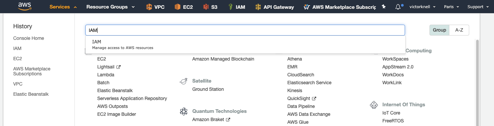

===========================
Activity 0: AWS IAM Account
===========================

In this activity you will create 2 users and a group for AWS.

Login on Linux dedicated hosted VM
----------------------------------

Instructor has to give you an URL to connect on predeployed VM prepared by himself (POD Machine).

Create a root AWS account
-------------------------
If you do not have an AWS account already, go to
https://aws.amazon.com/console/ and create an account. In order to continue you
will need to add a method of payment to your AWS account. Use the following
https://console.aws.amazon.com/billing/home#/paymentmethods
If creating a new account, you may receive a phone call from AWS for verification
purposes.

Log into the AWS console
------------------------

From the POD machine you can open firefox and navigate to the `AWS URL <https://console.aws.amazon.com/>`_

Log in with your AWS credentials. 
You will create a specific role for for AWS console and terraform in a few minutes.

Create IAM account for this Activity
------------------------------------

It is a best practice not to use the root account to create workloads and modify any configuration.
You will create a user and a group to access the console with the proper rights.

From AWS console, go to **Services** and choose **IAM** as shown:

Clic on **Users** as shown:

.. figure:: aws-iam-user.png

Create IAM account for console access
=====================================

Clic **Add User**, give a name and define **Access type** for **AWS Management Console access** as shown after that clic on **Next Permissions**:

.. figure:: aws-iam-user-add-console.png

.. figure:: aws-iam-user-creation-console.png

Next clic **Create Group**:

.. figure:: aws-iam-user-create-group-console.png

Provide a group name **utd** and filter **policy Type** menu by **FullAccess**, and add the following rights.
Amazon Rights for group **utd**:
    - AWSMarketplaceFullAccess
    - AmazonEC2FullAccess
    - AWSLambdaFullAccess
    - ElasticLoadBalancingFullAccess
    - AmazonS3FullAccess
    - CloudWatchFullAccess
    - AmazonVPCFullAccess
Then click **Create Group**:

.. figure:: aws-iam-user-group-creation-console.png

Then select the group:

Click **Next:Tags**, you can leave it empty and click **Next:Review** and finally click **Create User**:

.. figure:: aws-iam-user-review-console.png

The user is now created, download the CSV file to retrieve the password. After this step you can click on **Close**:

Create IAM account for API access
=================================

Clic **Add User**:

.. figure:: aws-iam-user-add-api.png

Give it a name and define **Access type** for **Programmatic access** as shown after that clic on **Next Permissions**:

.. figure:: aws-iam-user-creation-api.png

Next select the **utd** group previously created. And click on **Next:Tags**:

.. figure:: aws-iam-user-to-group-api.png

Clic **Next:Review**, and finally click on **Create User**:

.. figure:: aws-iam-user-review-api.png

The API user has been created, download the **Access key ID** and **Secret access key** by clicking **Download .csv**.These credentials are needed to connect to Amazon EC2 service through Terraform.

We also recommand to copy/paste theses information in a **notepad** to use them to create AWS environment variables.
After this step, you can click on close:

*This is the end of Activity 0*

