############
Requirements
############

The following are requirements of this training workshop:

***************
Laptop required
***************
- A laptop with Internet connectivity (SSH, alternative HTTP - TCP/8080 - and HTTPS access are required).
- A standards-compliant web browser (Firefox or Google Chrome are recommended).
- An understanding of Linux or Windows operating system basics.
- Proficiency with a text editor such as vim, sublime text, visual studio code or notepad++
- A basic understanding of cloud computing concepts.

********************
Provided POD or BYOD
********************

Predeployed Pod
===============

The instructor will give you an URL to connect on predeployed VM set with all required tools.

.. warning:: If you wish to deploy your own set of tools on your machine or lab machine here are the lists of what you will need to install tools on your own device. See the following sections.

Linux & Mac Endpoint
====================

- A standards-compliant web browser (Firefox or Google Chrome are recommended).
- An SSH client (any Terminal, OpenSSH, SecureCRT, etc).
- An SSL generator (ssh-keygen, OpenSSL).
- A code friendly Text editor (like VSCode, SublimeText or VIM/emacs))
- Terraform 0.11
- Ansible
- Python 3

Windows Endpoint
================

- A standards-compliant web browser (Firefox or Google Chrome are recommended).
- An SSH client (e.g., OpenSSH, PuTTY, SecureCRT, etc).
- An SSL generator for Windows (PuTTYgen, OpenSSL).
- A code friendly Text editor (like VSCode, SublimeText or Notepad++))
- Terraform 0.11
- Ansible
- Python 3

************************
Create your AWS Accounts
************************

Create a root AWS account
=========================
If you do not have an AWS account already, go to
https://aws.amazon.com/console/ and create an account. In order to continue you
will need to add a method of payment to your AWS account. Use the following
https://console.aws.amazon.com/billing/home#/paymentmethods
If creating a new account, you may receive a phone call from AWS for verification
purposes.

Create IAM AWS Accounts
=======================

You will need to create two users and a group on AWS for the labs.

Log into the AWS console
------------------------

Navigate to the `AWS URL <https://console.aws.amazon.com/>`_

Log in with your AWS credentials. 
You will create a specific role for for AWS console and terraform in a few minutes.

It is a best practice not to use the root account to create workloads and modify any configuration.
You will create a user and a group to access the console with the proper rights.

From AWS console, go to :guilabel:`Services` and choose :guilabel:`IAM` as shown:

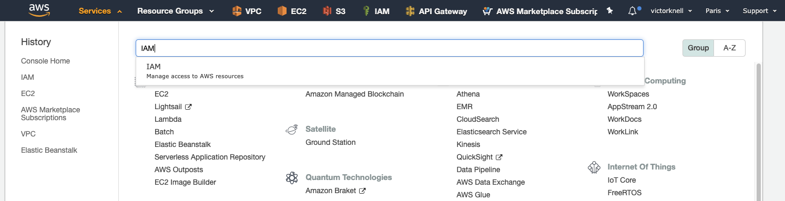

Clic on :guilabel:`Users` as shown:

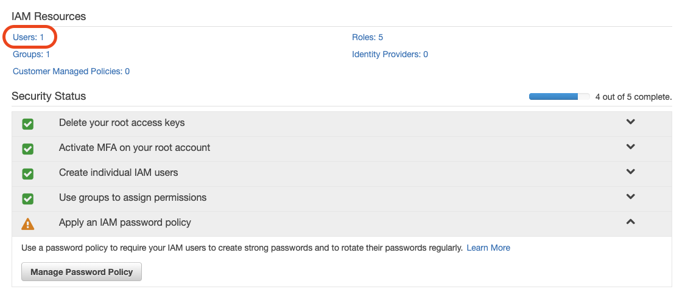

.. important:: A credit card is required for the AWS account to be valid. Each lab has a cost, if done properly and the environment deleted at the end of each lab the cost should be of the amount described at the beginning of each lab.

Create IAM account for console access
-------------------------------------

Clic :guilabel:`Add User`, give a name and define :guilabel:`Access type` for :guilabel:`AWS Management Console access` as shown after that clic on :guilabel:`Next Permissions`:

.. figure:: img/aws-iam-user-add-console.png

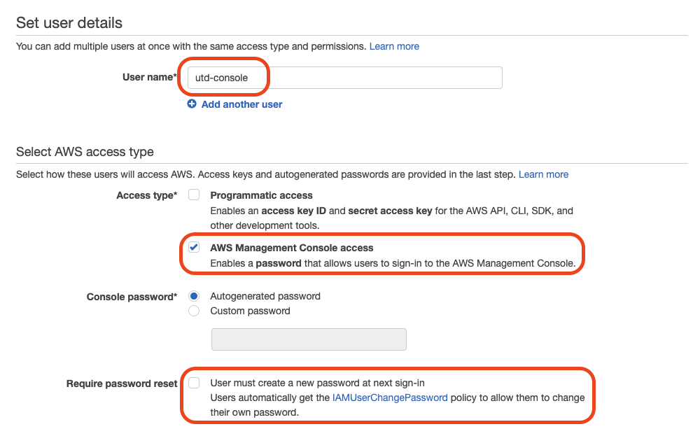

Next clic :guilabel:`Create Group`:

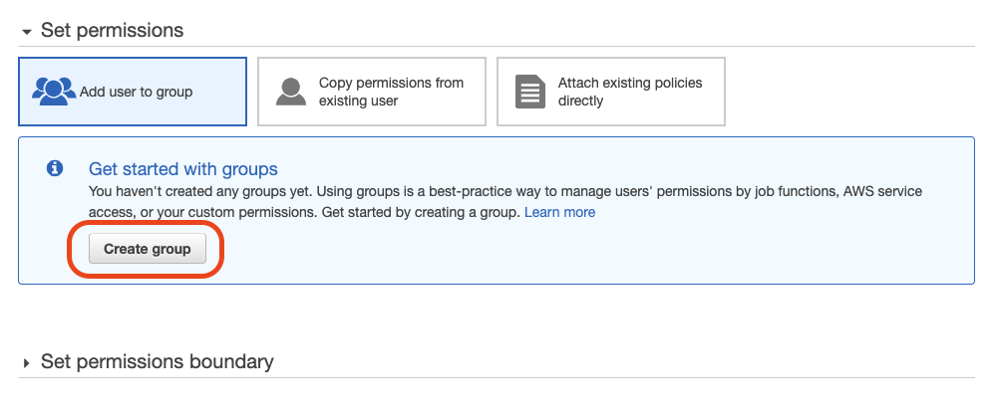

Provide a group name :guilabel:`utd` and filter :guilabel:`policy Type` menu by :guilabel:`FullAccess`, and add the following rights.
Amazon Rights for group :guilabel:`utd`:
    - AmazonEC2FullAccess
    - AmazonS3FullAccess
    - AmazonVPCFullAccess
    - AWSLambdaFullAccess
    - AWSMarketplaceFullAccess
    - CloudWatchFullAccess
    - ElasticLoadBalancingFullAccess
    - IAMFullAccess
Then click :guilabel:`Create Group`:

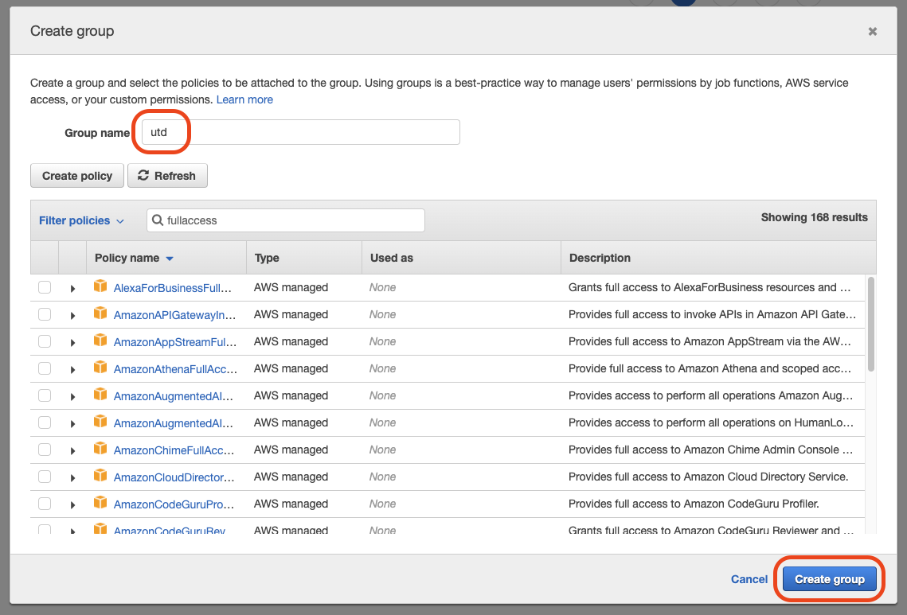

Then select the group:

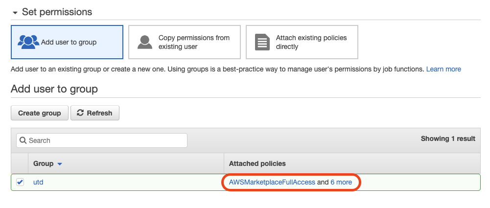

Click :guilabel:`Next:Tags`, you can leave it empty and click :guilabel:`Next:Review` and finally click :guilabel:`Create User`:

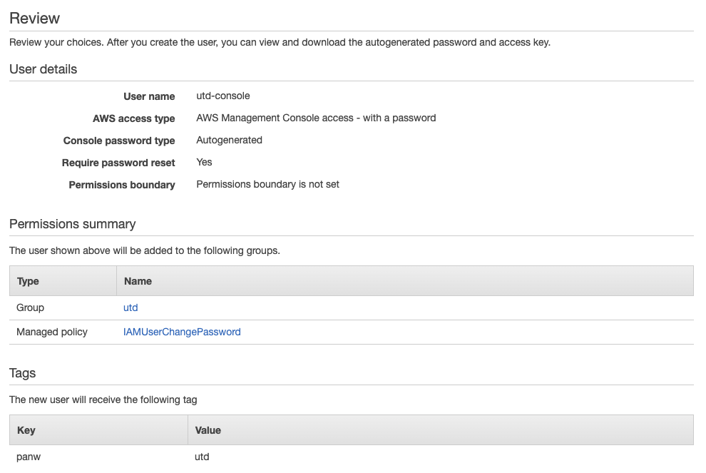

.. warning:: Do not skip this step, the password is not visible in the console afterward.

The user is now created, download the CSV file to retrieve the password. After this step you can click on :guilabel:`Close`:

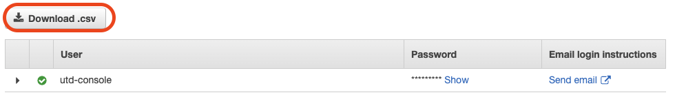

Create IAM account for API access
---------------------------------

Clic :guilabel:`Add User`:

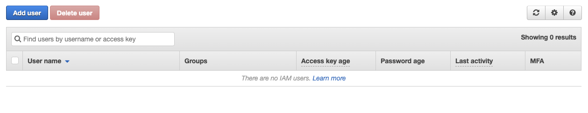

Give it a name and define :guilabel:`Access type` for :guilabel:`Programmatic access` as shown after that clic on :guilabel:`Next Permissions`:

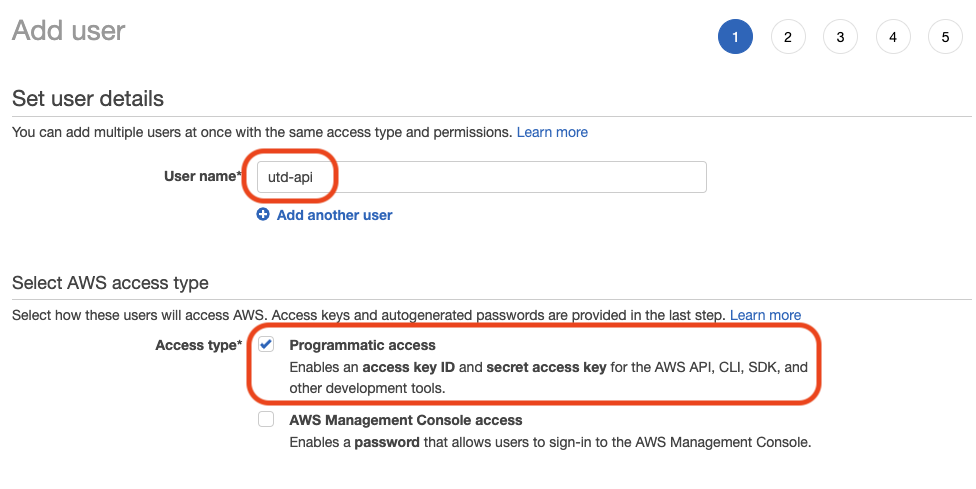

Next select the :guilabel:`utd` group previously created. And click on :guilabel:`Next:Tags`:

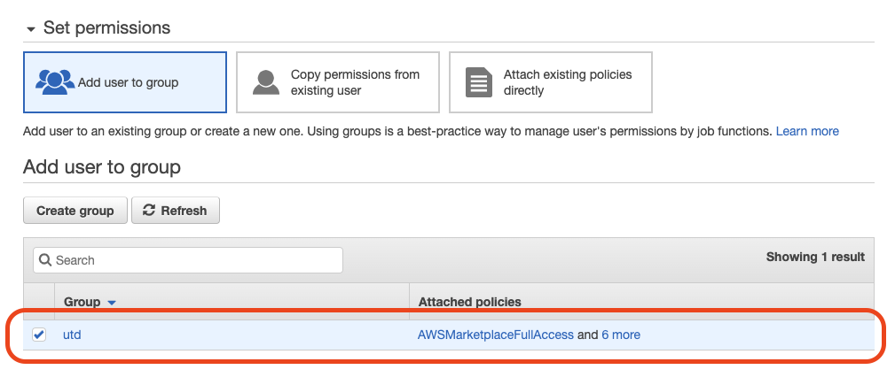

Clic :guilabel:`Next:Review`, and finally click on :guilabel:`Create User`:

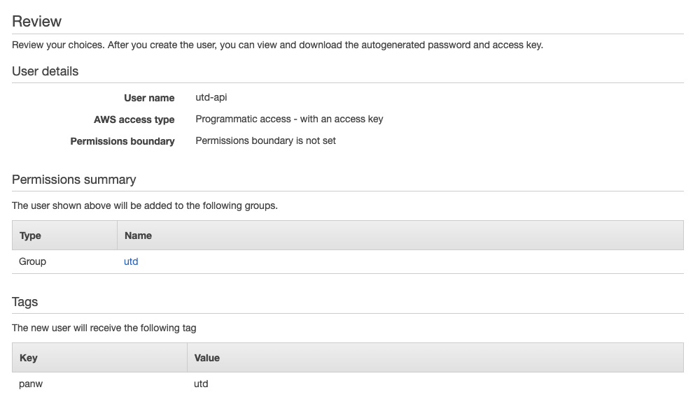

The API user has been created, download the :guilabel:`Access key ID` and :guilabel:`Secret access key` by clicking :guilabel:`Download .csv`.These credentials are needed to connect to Amazon EC2 service through Terraform.

We also recommand to copy/paste theses information in a **text editor** to use them to create AWS environment variables.
After this step, you can click on close:

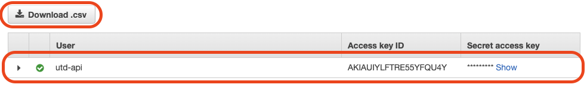

Launch a first EC2 instance to sign the EULA
============================================

.. warning:: To be able to launch an EC2 instance of a Palo Alto Networks VM Series, you need to first approve the End-User Licence Agreement. If no date is displayed under the :guilabel:`Effective Date` in your subscription page of the product, your subscription is not yet approved and you won't be able to use this AMI.

To do that log in using any account and search for Palo Alto Networks in the marketplace. Click on :guilabel:`Services`, type ``Marketplace`` and open the link:

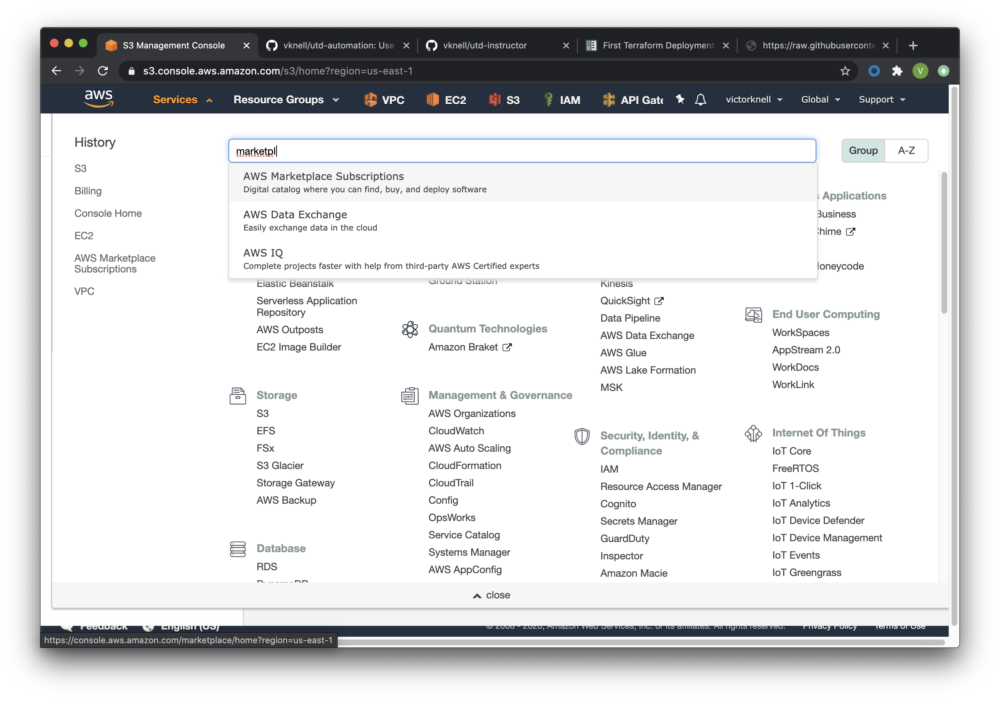

Then choose :guilabel:`discover` in the left menu and search for ``Palo Alto Networks``:

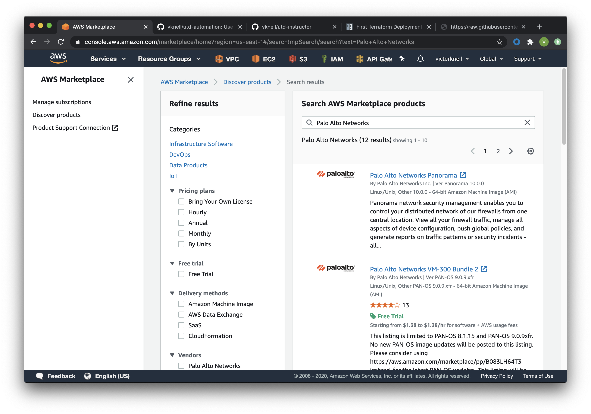

Open the four following links in new tabs:

- Palo Alto Networks VM-300 Bundle 2
- VM-Series Next-Generation Firewall (BYOL and ELA)
- VM-Series Next-Generation Firewall Bundle 1
- VM-Series Next-Generation Firewall Bundle 2

For each one, click on :guilabel:`Continue to Subscribe` and :guilabel:`Accept the terms`:

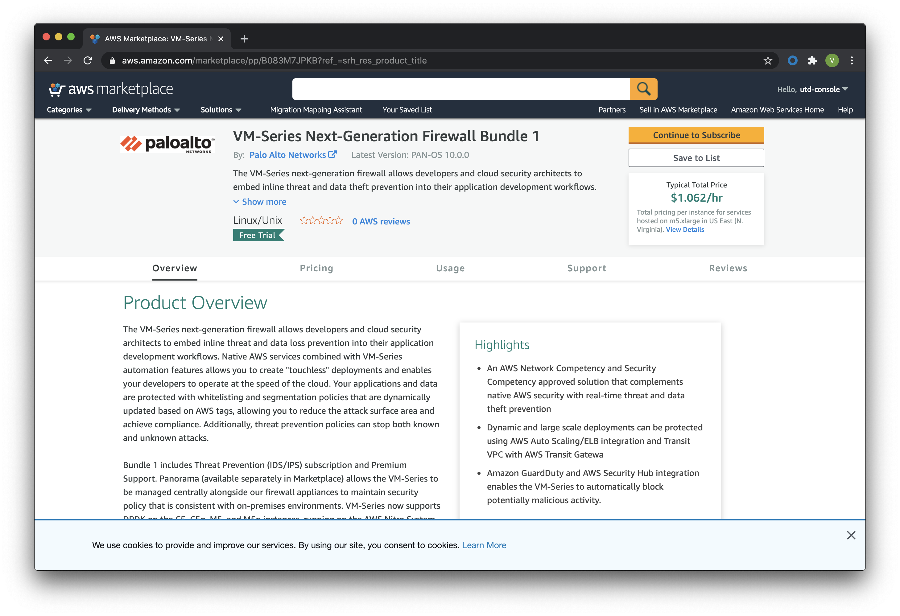

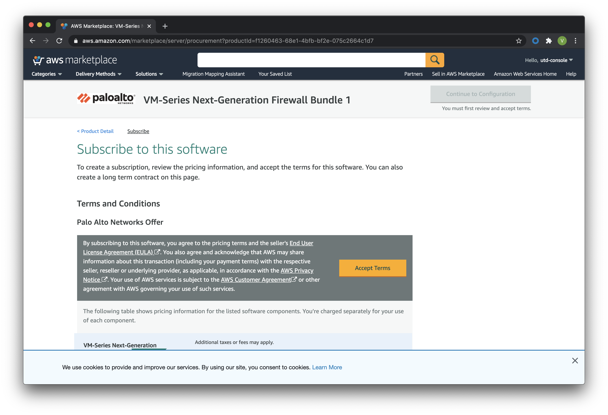

Once done you should see a green ribbon at the top of the screen *Thanking you for subscribing*, the :guilabel:`effective date` will be in the pending state. This step can take several minutes (20-30).

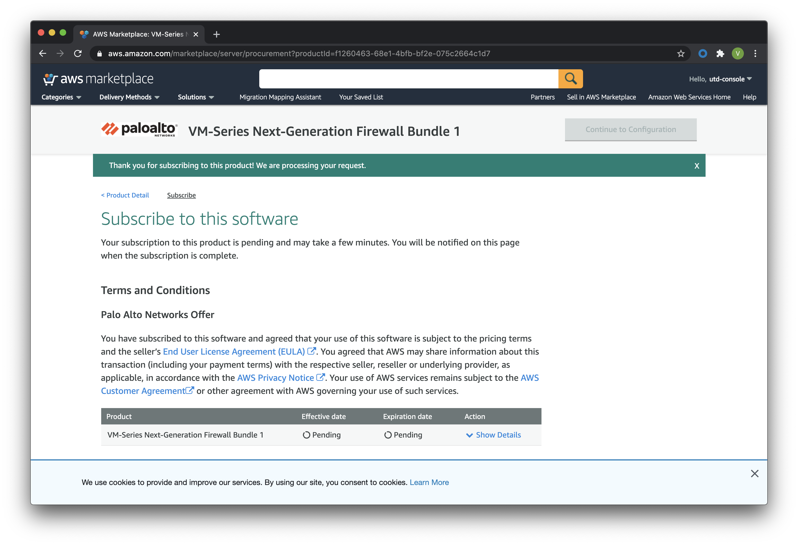

You should also receive an email from AWS, letting you know that the service is now available:

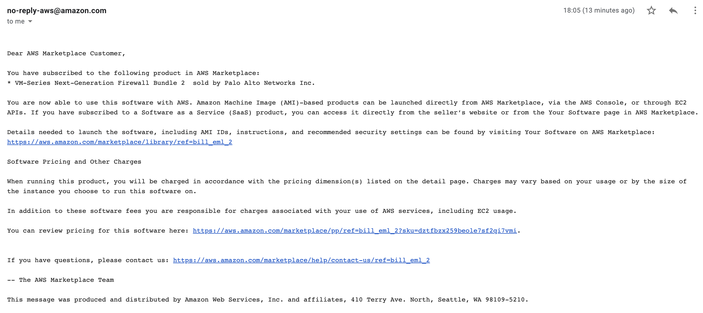

