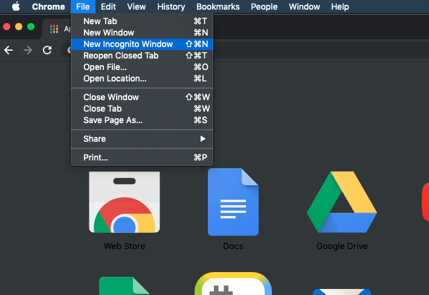

=====
Setup
=====

In this activity you will:

- Login on dedicated hosted VM
- Log into the AWS portal
- Discovery VSCodium
- Open Terminal
- Clone the lab software repository

.. warning:: Before you start it is recommended that you launch a private instance
          of your web browser.  This will prevent the use of cached Google or
          Amazon credentials if you log into the AWS consoles.  This
          will help ensure you do not incur any company charges within these
          cloud providers.

    Chrome Incognito mode

Login on Linux dedicated hosted VM
-----------------------------
Instructor has to give you an URL to connect on predeployed VM prepared by hiself (POD Machine).

Log into the AWS console
----------------------------

From the POD machine you can open firefox and navigate to the `AWS URL <https://console.aws.amazon.com/>`_

Log in with your AWS credentials. 
You will create a specific role for terraform in a few minutes.

Discovery VSCodium
------------------

On desktop POD Machine you can find a shortcut named VSCodium. Double clic to launch this application.
VSCodium will be your automation tool during this lab.
Speaker will show you how to use it.

