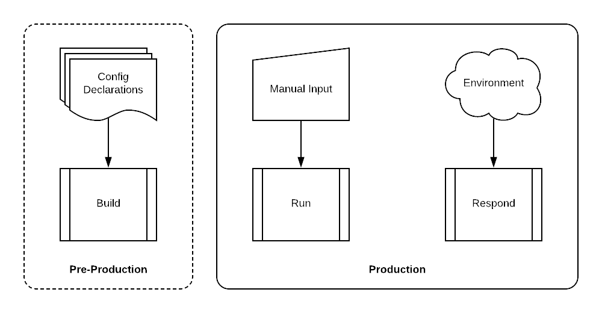
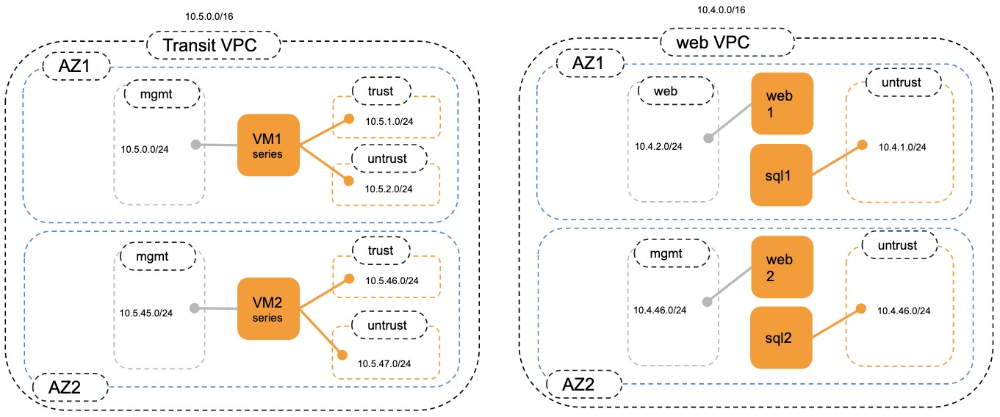

============
Introduction
============

Automation Overview
-------------------

This training workshop provides hands-on exposure to the three primary
categories of infrastructure automation activities: **Build**, **Run**, and
**Respond**.

Build
    Build automation is the means by which a set of infrastructure elements are
    declared, instantiated, and orchestrated using automation tools and
    infrastructure APIs.  The result is a set of deployed infrastructure
    elements that are in production (or production-ready) with a "day one"
    configuration.

Run
    Run automation encompasses any API-based configuration management actions
    that occur once the infrastructure element is in production.  These are
    primarily scheduled changes that are made to support new requirements.  The
    input to these changes is manually defined in a variety of formats such as
    YAML, JSON, XML, etc.

Respond
    Response automation includes any automated actions that are triggered by an
    event.  These may be operational events such as changes to the
    infrastructure or security events such as of a new threat. Response actions
    are defined in advance but only initiated when a event matching its trigger
    criteria occurs.

Lab Topology
------------

+--------------+--------------+-------------+
| Subnet       | Address      | Interface   |
+==============+==============+=============+
| ManagementFW1| 10.5.0.0/24  | Management  |
+--------------+--------------+-------------+
| ManagementFW2| 10.5.45.0/24 | Management  |
+--------------+--------------+-------------+
| WEB1         | 10.4.2.0/24  | web - 1     |
+--------------+--------------+-------------+
| WEB2         | 10.4.46.0/24 | web - 2     |
+--------------+--------------+-------------+
| SQL1         | 10.4.1.0/24  | sql - 1     |
+--------------+--------------+-------------+
| SQL2         | 10.4.1.0/24  | sql - 1     |
+--------------+--------------+-------------+
| Untrust FW1  | 10.5.2.0/24  | Unt - 1     |
+--------------+--------------+-------------+
| Untrust FW2  | 10.5.47.0/24 | Unt - 2     |
+--------------+--------------+-------------+
| trust FW1    | 10.5.1.0/24  | Tru - 1     |
+--------------+--------------+-------------+
| trust FW2    | 10.5.46.0/24 | Tru - 2     |
+--------------+--------------+-------------+

Lab Components
--------------

AWS Amazon Web Service
    Amazon Web Services is a subsidiary of Amazon that provides on-demand cloud
    computing platforms to individuals, companies and governments, on a metered
    pay-as-you-go basis.
    This lab is launched using AWS Account, which is gived by your prefered SE or you can use your own account (better)
    One login and password provides access to cloud-based lab environments. the account
    is temporary in the cloud provider in order to deploy and access the cloud infrastructure.

Visual Studio Code
    This lab can be perform with any text editor, but we advise to use visual studio code with ansible & terraform plugins
    Visual Studio code can be download under the MIT license without telemetry, `you can install it on your endpoint <https://vscodium.com/>`_
    Dont hesitate to scroll on vscodium webpage to understand how install it in a few second.

Launchpad VM
    An Ubuntu virtual machine can be deployed in a cloud environment for you to use as your primary workspace for the lab activities
    This VM will be provisioned with all the tools and libraries necessary for deploying and managing infrastructure in the cloud provider.
    But we advise to install on your endpoint the different tools to be autonomous after the lab.

Hashicorp Terraform
    Each cloud provider offers a mechanism that allow you to define a set of
    infrastructure element or services and orchestrate their instantiation.
    However, these tools and templates are specific to each cloud provider.
    We will be using Terraform to perform this function as it provides a
    common set of capabilities and a template formats acroos all cloud
    providers.

Red Hat Ansible
    Whereas Terraform excels at orchestrating deployment activities, Ansible is
    more effective at automating configuration management tasks.  We will be
    using both Terraform and Ansible to make configuration changes to the
    VM-Series firewall in order to illustrate their different capabilities.