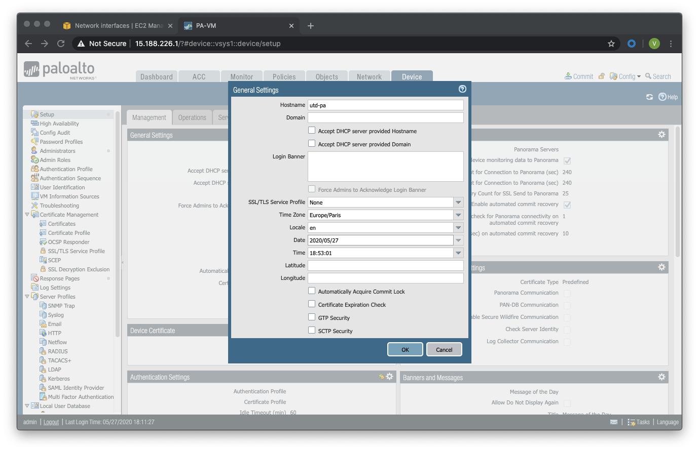

=======================================
Activity 1.1: AWS Deploy your first VPC
=======================================

Architecture de l’infrastructure à déployer sur AWS :


Login on Linux dedicated hosted VM
----------------------------------
Instructor has to give you an URL to connect on predeployed VM prepared by hiself (POD Machine).


Log into the AWS console
------------------------

From the POD machine you can open firefox and navigate to the `AWS URL <https://console.aws.amazon.com/>`_

Log in with your AWS **utd-console** account (your IAM account for API console) see the doc `here <https://utd-automation.readthedocs.io/en/latest/00-getting-started/aws-account.html>`_.


Création d’un VPC (Virtual Private Cloud)
-----------------------------------------


Etape 1 : Allez dans Services, faites une recherche sur VPC et choisissez le service VPC :


Etape 2 : Allez à Virtual Private Cloud > Your VPC > Create VPC

.. figure:: img/create-vpc-1.png


Etape 3 : Remplissez le nom du VPC, le sous réseau, laissez les autres paramètres par défaut et cliquez sur Save pour sauvegarder :


Etape 4 : Sélectionnez le VPC **utd-activity1** et allez dans Actions > Edit DNS hostnames


Etape 5 : Dans Edit DNS hostnames, cochez le bouton enable et sauvegardez


Création des sous réseaux AWS (subnets)
---------------------------------------

Le bloc de réseaux IPv4 créé avec le VPC sera maintenant segmenté en plusieurs sous réseaux. Vous pouvez créer des sous-réseaux ayant des plages d’adresses IP qui feront partis du bloc IPv4 du VPC.
Les sous réseaux seront utilisés comme suit :

+--------------+--------------+-------------+--------------------+
| Subnet       | Address      | Interface   | Availability Zone  |
+==============+==============+=============+====================+
| Management   | 10.2.0.0/24  | management  | eu-west-3          |
+--------------+--------------+-------------+--------------------+
| Internet     | 10.2.1.0/24  | internet    | eu-west-3          |
+--------------+--------------+-------------+--------------------+
| Web Server   | 10.2.2.0/24  | web         | eu-west-3          |
+--------------+--------------+-------------+--------------------+


Etape 1: allez dans VPC > Subnets > Create subnet


Etape 2 : Renseignez le nom, le VPC *utd-activity1*, choisissez la première zone d'availibility.


Etape 3 : Répétez l’étape précédente pour les deux autres sous réseaux *internet* et *web*.


Création d’une passerelle Internet IGW
--------------------------------------

La création d’un passerelle Internet est indispensable pour permettre au VPC de se connecter à Internet. Une fois que la passerelle est créée, il sera nécessaire de l’attacher à un VPC.


Etape 1 : Allez dans VPC > Internet Gateways > Create internet gateway et utilisez *utd-activity1-igw* comme nom

.. figure:: img/create-vpc-10.png


Etape 2 : Sélectionnez l’IGW *utd-activity1-igw* et ensuite allez dans Actions > Attach to VPC


Etape 3 : Sélectionner le VPC *utd-activity1* et sauvegarder


It may take up to a few minutes before the attached state goes to green.


Création des tables de routage
------------------------------

Les tables de routage vous permettent d'attribuer une connectivité telle que des passerelles Internet et des passerelles par défaut à des groupes spécifiques de points de terminaison. Rappelez-vous que tous les points d'extrémité dans le VPC peuvent se connecter de manière native à n'importe quel autre point d'extrémité dans le bloc CIDR VPC affecté (exemple : 10.2.0.0/16). Cela ne peut pas être modifié par une table de routage. Il existe une table de routage principale créée par défaut pour un VPC, et tous les sous-réseaux qui ne sont pas affectés à une table de routage personnalisée sont affectés à la table de routage principale du VPC. Par défaut, la table de routage principale route uniquement vers le bloc CIDR VPC. Les tables de routage peuvent contrôler toute connectivité de sous-réseau IP en
dehors du bloc CIDR VPC.

Bien que les tables de routage *internet-rt* (publique) et *management-rt* (table de routage du
subnet de Management) soient programmées de la même manière ci-dessous, elles sont réparties
séparément car vous pouvez personnaliser votre table de routage *management-rt* pour accéder
uniquement aux destinations de gestion sélectionnées via l'IGW par rapport à une table ouverte par défaut de 0.0.0.0/0. Il existe une table de routage de serveur Web pour chaque zone de disponibilité et une route par défaut sera ajoutée plus loin dans ce guide, une fois les pare-feux programmés et opérationnels.

Ci-dessous, les tables de routage à créer sont décrites dans le tableau ci-dessous :

# Change to VPC INGRESS ROUTING - New

+--------------------+--------------+----------+--------------+
| Route Table        | Prefix       | Target   | Subnet       |
+====================+==============+==========+==============+
| utd-mgmt-rt        | 10.2.0.0/16  | local    | Management   |
+--------------------+--------------+----------+--------------+
| utd-mgmt-rt        | 0.0.0.0/16   | igw      | Management   |
+--------------------+--------------+----------+--------------+
| utd-internet-rt    | 10.2.0.0/16  | local    | Internet     |
+--------------------+--------------+----------+--------------+
| utd-internet-rt    | 0.0.0.0/16   | igw      | Internet     |
+--------------------+--------------+----------+--------------+
| utd-web-rt         | 10.2.0.0/16  | local    | Web Server   |
+--------------------+--------------+----------+--------------+

Etape 1 : Créez la table de routage *utd-management-rt* en allant vers Services > VPC > Virtual Private Cloud > Routes Tables > Create route table.

Etape 2 : Entrez le nom de la table de routage, sélectionnez le VPC *utd-activity1* et sauvegardez.


Etape 3 : Sélectionnez la table de routage *utd-management-rt*


Etape 4 : Allez dans Routes pour ajouter une nouvelle route par défaut en cliquant sur Edit Routes


Etape 5 : Ajoutez la nouvelle route 0.0.0.0/0, sélectionnez la passerelle internet *utd-activity1-igw* créée au niveau du Target et sauvegardez les changements.


Etape 6 : Allez dans Subnet Associations > Edit subnet associations


Etape 7 : Sélectionnez Management_Subnet et sauvegardez


Etape 8 : Répétez les étapes 1 à 7 pour créer, modifier la table de routage et associer le subnet pour la table de routage utd-internet-rt


Etape 9 : Créez la table de routage utd-web-rt et le subnet associé à cette dernière.

Attention : Pas de route par défaut pour la table de routage utd-web-rt, cette route par défaut sera ajoutée ultérieurement.


Création des groupes de sécurité (Security Groups)
--------------------------------------------------

Lorsque vous créez une instance de calcul AWS Elastic Compute (EC2) pour exécuter une instance de machine virtuelle, vous devez attribuer un groupe de sécurité (SG) nouveau ou existant à cette instance. Les groupes de sécurité fournissent un pare-feu à état de couche 4 pour le contrôle des adresses IP sources/destinations et les ports qui sont autorisés à destination ou en provenance des instances associées. Les SG sont appliqués aux interfaces réseau. Jusqu'à cinq SG peuvent être associés
à une interface réseau. L'accès sortant par défaut est autorisé pour permettre l'ensemble du trafic de sortir vers tous les lieux ; vous pouvez toutefois la personnaliser en fonction de vos opérations. Par défaut, la liste d'accès aux services entrants est définie de manière à ne pas autoriser le trafic ; vous modifierez cette configuration en fonction des tableaux ci-dessous.


Vous configurez les groupes de sécurité à affecter au pare-feu de la VM-Series et au serveur Web :

* internet (interface publique du pare-feu) : Initialement, tout le trafic sera autorisé vers les périphériques du groupe de sécurité publique, par exemple le groupe de sécurité publique du pare-feu, et le pare-feu contrôlera le trafic grâce à des politiques de sécurité. Vous pouvez restreindre l’accès au réseau seulement aux ports de la couche 4 nécessaires. Ce dernier réduira la charge de trafic inutile qui pourra arriver sur l’interface publique du firewall.
* management : autoriser les ports nécessaires pour pouvoir gérer votre firewall
comme l’ICMP, le SSH et le HTTPS
* web : Autoriser les flux nécessaires pour les flux de gestion du serveur web et
évidemment les flux web.

*utd-internet-sg* – inbound rules

+------------------+-----------+-------------+------------+
| Type             | Protocol  | Port range  | Source     |
+==================+===========+=============+============+
| SSH              | TCP       | 22          | Anywhere   |
+------------------+-----------+-------------+------------+
| HTTP             | TCP       | 80          | Anywhere   |
+------------------+-----------+-------------+------------+
| HTTPS            | TCP       | 443         | Anywhere   |
+------------------+-----------+-------------+------------+
| All ICMP - IPv4  | ICMP      | All         | Anywhere   |
+------------------+-----------+-------------+------------+

*utd-management-sg* – inbound rules

+------------------+-----------+-------------+------------+
| Type             | Protocol  | Port range  | Source     |
+==================+===========+=============+============+
| SSH              | TCP       | 22          | Anywhere   |
+------------------+-----------+-------------+------------+
| HTTPS            | TCP       | 443         | Anywhere   |
+------------------+-----------+-------------+------------+
| All ICMP - IPv4  | ICMP      | All         | Anywhere   |
+------------------+-----------+-------------+------------+

*utd-web-sg* – inbound rules

+------------------+-----------+-------------+------------+
| Type             | Protocol  | Port range  | Source     |
+==================+===========+=============+============+
| SSH              | TCP       | 22          | Anywhere   |
+------------------+-----------+-------------+------------+
| HTTP             | TCP       | 80          | Anywhere   |
+------------------+-----------+-------------+------------+
| HTTPS            | TCP       | 443         | Anywhere   |
+------------------+-----------+-------------+------------+
| All ICMP - IPv4  | ICMP      | All         | Anywhere   |
+------------------+-----------+-------------+------------+

Etape 1: Cliquez sur Security Groups sur le bandeau de gauche:


Etape 2 : Donnez un nom au Group, une description, associez le SG au VPC *utd-activity1* et ajoutez les règles de sécurité comme indiqué dans l’image suivante


Et validez:


Etape 3 : Répétez l’étape 2 pour créer *utd-management-sg*

Etape 4 : Répétez l’étape 2 pour créer *utd-web-sg*

Au total, trois SG doivent être créés comme suit:


Création des interfaces réseau pour le firewall virtuel VM-Series
-----------------------------------------------------------------

Avant d’installer l’instance de pare-feu virtuel, vous allez créer les interfaces Ethernet1/1 et Ethernet1/2 pour l’associer ultérieurement à la VM-Series.

Etape 1: Allez dans Services > EC2 > Network & Security > Network Interfaces > Create Network
Interface


Etape 2 : Créez l’interface Ethernet1/1 qui est l’interface **Internet** en donnant une description, sélectionnant le subnet Untrusted_Subnet, donnant l’adresse IP *10.2.1.10* et en sélectionnant le Security Group *utd-web-sg*


Etape 3 : Créez l’interface Ethernet1/2 qui est l’interface **Web** en donnant une description, sélectionnant le subnet Trusted_Subnet, donnant l’adresse IP *10.2.5.10* et en sélectionnant le Security Group *utd-web-sg*


Déploiement de la VM-Series 300 dans AWS
----------------------------------------

Le pare-feu VM-Series sera déployé dans le VPC *utd-activity1* créé précédemment. L’interface de gestion est dans le sous-réseau Management_Subnet. Les sous-réseaux d'adresses IP, les tables de routage et les groupes de sécurité ont été mis en place dans la section précédente pour l'ensemble du VPC et sont utilisés dans cette section.
Dans un premier temps le firewall sera déployé avec une seule interface qui est l’interface de management. Une fois déployé, vous allez lui associer les interfaces créées dans l’étape précédente.

Etape 1 : Allez dans Services > EC2 > Instances > Instances > Launch Instance, sélectionnez AWS Marketplace, faites une recherche sur Palo Alto Networks et sélectionnez VM-Series Next-Generation Firewall (BYOL and ELA)


Etape 2 : Dans Choose Instance Type, cherchez le type m5.xlarge, sélectionnez et cliquez sur Next:Configure Instance Details

Etape 3 : Dans Configure Instance Details, sélectionnez le VPC *utd-activity1* pour Network, dans Subnet sélectionner Management_Subnet. You can leave Auto-assign Public IP to the default behaviour which is *Disable* et dans Network Interfaces > Primary IP modifiez le champ pour mettre l’adresse IP *10.2.0.10*.

.. figure:: img/create-vpc-33.png

Etape 4: Dans Add Storage, cliquez sur Next Next : Add Tags (aucune modification)

Etape 5 : Dans Add Tags, cliquez sur Next : Configure Security Group

Etape 6 : Dans Configure Security Group, sélectionnez le groupe de sécurité Management_SG, et cliquez sur Review and Launch


Etape 7 : Dans Review and Launch, cliquez sur Launch

Etape 8 : Créez une paire de clé publique/clé privée pour pouvoir se connecter en SSH sur le firewall.
Il faut choisir Create a new key pair, donner à un nom (comme *utd-activity1-kp*), télécharger la paire de clés sur votre machine et enfin, lancer le déploiement en cliquant sur Launch Instances


Retournez dans le panneau de gestion des interfaces Services > EC2 > Network & Security > Network Interfaces et nommez vos interfaces *utd-eth1/1*, *utd-eth2/2* et *utd-mgmt* pour l'interface nouvellement créée.


Création de adresses IP publiques
---------------------------------

Etape 1 : Allez dans Services > EC2 > Network & Security > Elastic IP > Allocate Elastic IP Address

Etape 2 : Sélectionnez Amazon’s pool of IPv4 addresses et cliquez sur allocate pour allouer une première adresse publique IPv4


Etape 3 : Répétez les deux étapes précédentes pour allouer une deuxième adresse IP publique

tape 4 : Sélectionnez une des deux adresses IP publiques, ensuite allez dans Actions > Associate Elastic IP address


Etape 5 : Sélectionnez Network interface dans Resource type, dans Network Interface sélectionnez l’interface *utd-mgmt* et dans Private IP address, sélectionnez l’adresse IP privée du subnet *10.2.0.10*


Etape 6 : Dans cette étape, il faut sélectionner la deuxième adresse IP qui n’est pas encore allouée, ensuite allez dans Actions > Associate Elastic IP Address

Etape 7 : Sélectionnez Network interface dans Resource type, dans Network Interface sélectionnez l’interface *utd-eth1/1* et dans Private IP address, sélectionnez l’adresse IP privée du subnet *10.2.1.10*


Attacher les interfaces Ethernet1/1 et Ethernet1/2 au Firewall
--------------------------------------------------------------

Etape 1 : Allez dans Services > EC2 > Network & Security > Network Interfaces, Sélectionnez
l’interface Ethernet1/1, cliquez sur Attach, choisissez l’instance du firewall dans Instance ID et cliquez sur Attach


Etape 2 : Répétez l’étape 1 pour attacher l’interface Ethernet1/2 à l’instance Firewall


Première connexion à la VM-Series
---------------------------------

Par défaut et pour un nouveau déploiement de VM-Series dans AWS, l’instance déployée ne contient pas de mot passe pour le compte admin. Il est donc nécessaire de se connecter en SSH sur le pare-feu en utilisant la paire de clés générée durant l’étape de déploiement pour attribuer un mot de passe au compte administrateur. Une fois que le mot de passe est configuré, vous pouvez vous connecter au pare-feu via l’adresse IP publique de Management.

Ci-dessous, les étapes nécessaires seront détaillées.
Etape 1 : Ouvrez un terminal Linux sur la machine de Lab

Etape 2 : Connectez-vous en ssh sur la VM-Series admin@**your-ip** -i *utd-activity1*.pem
```
cd Downloads
chmod 600 utd-activity1-kp.pem 
ssh -i utd-activity1-kp.pem admin@your-ip
```

Etape 3 : Configurez le mot de passe admin entrant la commande suivante:
```
configure
set mgt-config users admin password
```

Etape 4 : Sauvegardez les modifications via un commit et quittez le terminal Linux
```
commit
exit
exit
```

Etape 5 : Naviguez sur le firewall virtuel avec l’adresse IP publique avec le login admin et le mot de passe configuré durant l’étape précédente : https://**your-ip**


Configuration du pare-feu nouvelle génération
---------------------------------------------

Configurer les Zones

Etape 1 : Allez dans Networks > Zones > Add

Etape 2 : Ajoutez une nouvelle zone nommée *internet* et de type Layer3


Etape 3 : Ajoutez une deuxième zone nommée Trusted de type Layer3


Configurer un Profil de Management d’Interface
----------------------------------------------

Etape 1 : Dans Network > Network Profiles > Interface Mgmt cliquez sur Add en bas à gauche et ajoutez un nouveau profil de gestion.

Etape 2 : attribuez le nom PingProfile au profil de gestion, sélectionnez le Ping dans Networks Services et cliquez sur OK


Configurer les interfaces Ethernet1/1 et Ethernet1/2
Etape 1 : Allez dans Network > Interfaces > Ethernet1/1

Etape 2 : Dans Interface Type, sélectionnez Layer3

Etape 3 : Dans l’onglet Config, sélectionnez le routeur virtuel default et la zone de sécurité *internet*


Etape 4 : Dans l’onglet IPv4, sélectionnez DHCP Client, cochez Enable et Automatically create default route pointing to default gateway provided by server


Etape 5 : Dans l’onglet Advanced, allez dans Management Profile, sélectionnez PingProfile et cliquez sur OK


Etape 6 : Ouvrez Ethernet1/2. Dans Interface Type, sélectionnez Layer3 et dans l’onglet Config, sélectionnez le routeur virtuel default et la zone de sécurité *web*


Etape 7 : Dans l’onglet IPv4, sélectionnez DHCP Client, cochez Enable et décochez Automatically create default route pointing to default gateway provided by server


Etape 8 : Dans l’onglet Advanced, allez dans Management Profile, sélectionnez PingProfile et cliquez sur OK


Configurer les objets
---------------------

Etape 1 : Créez un objet d’adresse en allant dans Objects > Addresses > Add, nommez l’objet
*WebServer_Private*, sélectionnez IP Netmask comme Type et ajoutez l’adresse IP *10.2.2.11*


Etape 2 : Créez un deuxième objet d’adresse en allant dans Objects > Addresses > Add, nommez l’objet *WebServer_Public*, sélectionnez IP Netmask comme Type et ajoutez l’adresse IP *10.2.1.10*


Configuration Système du pare-feu
---------------------------------

Dans cette section, la configuration système du firewall sera décrite. Cette configuration sera nécessaire pour que le firewall soit capable d’activer la licence dans la section suivante. La configuration de DNS, NTP, Hostname et Timezone est décrite ci-dessous.

Etape 1 : Allez dans Device > Setup > Management > General Setting, attribuez au firewall un nom dans le champ Hostname comme utd-pa, sélectionnez Europe/Paris dans TimeZone et validez



Etape 2 : Dans l’onglet Services > Services, ajoutez l’adresse *8.8.8.8* comme adresse du Primary DNS Server et *1.1.1.1* comme Secondary DNS


Etape 3 : Dans l’onglet NTP, ajoutez l’adresse 0.fr.pool.ntp.org comme adresse de NTP Primaire et 1.fr.pool.ntp.org comme NTP secondaire.


Configuration des règles de sécurité
------------------------------------

Les étapes suivantes consistent à ajouter les bonnes règles de sécurité afin de vous permettre à la fois de gérer votre Serveur Web à distance (via ssh), d’accéder en HTTP vers le serveur Web depuis Internet et de laisser ce dernier sortir sur Internet pour télécharger et installer le package Apache. Vous allez configurer les mêmes règles de sécurité qui sont détaillées dans la figure suivante :

+-------------------+--------------+------------------+---------------------+-----------------------+
| Name              | Source Zone  | Destination Zone | Destination Address | Application           |
+===================+==============+==================+=====================+=======================+
| web_to_internet   | web          | internet         | any                 | ssl & web-browsing    |
+-------------------+--------------+------------------+---------------------+-----------------------+
| web_server_access | internet     | web              | WebServer_Public    | icmp & web-browsing   |
+-------------------+--------------+------------------+---------------------+-----------------------+
| web_server_ssh    | internet     | web              | WebServer_Public    | ssh                   |
+-------------------+--------------+------------------+---------------------+-----------------------+

En plus des règles de sécurité, il est nécessaire de configurer les règles de NAT (source et destination).
La figure suivante décrit les règles de NAT à configurer sur le firewall.

+-------------------+--------------+------------------+---------------------+-----------------+------------------------------+-----------------------------+
| Name              | Source Zone  | Destination Zone | Destination Address | Service         | Source Translation           | Destination Translation     |
+===================+==============+==================+=====================+=================+==============================+=============================+
| NAT_outside       | web          | internet         | any                 | any             | dynamic ip & port & int eth1 | none                        |
+-------------------+--------------+------------------+---------------------+-----------------+------------------------------+-----------------------------+
| web_server_access | internet     | internet         | WebServer_Public    | service-http    | none                         | WebServer_Private & port 80 |
+-------------------+--------------+------------------+---------------------+-----------------+------------------------------+-----------------------------+
| web_server_ssh    | internet     | internet         | WebServer_Public    | ssh (create it) | none                         | WebServer_Private & port 22 |
+-------------------+--------------+------------------+---------------------+-----------------+------------------------------+-----------------------------+


Sauvegarder la configuration du pare-feu
Une fois la configuration terminée, un **Commit** est indispensable pour appliquer l’ensemble des modifications. Cliquez en haut à droite et validez:


Activation de la licence (Auth-Code)
------------------------------------

Utilisez le code d’autorisation (auth-code) que vous avez reçu par mail pour activer toutes les fonctionnalités de sécurité sur votre NGFW.

Etape 1 : Allez dans Devices > Licenses

Etape 2 : Cliquez sur Activate features using Authorization Code, entrez l’auth-code reçu par e-mail et validez

Etape 3 : Une fois la validation faite, cliquez sur Retrieve licence from licence server. Quelques secondes plus tard, toutes les licences seront activées


Déploiement et configuration du serveur Web protégé par la VM-Series
--------------------------------------------------------------------

Configurer une route par défaut pour le subnet Trusted_Subnet

Etape 1 : Allez dans Services > VPC > Routes tables > **utd-web-rt** > Routes > Edit Routes et ajoutez une route par défaut qui pointe vers l’interface Ethernet1/2 du NGFW virtuel déployé précédemment

Etape 2 : Sauvegardez les modifications via Save routes


Déployer le nouveau serveur web
Etape 1 : Allez dans Services > EC2 > Instances > Instances > Launch Instance. Dans Choose AMI sélectionnez Amazon Linux 2 AMI (HVM), SSD Volume Type


Etape 2 : Dans Choose Instance Type, sélectionnez le type t2.micro et cliquez sur Next : Configure Instance details


Etape 3 : Dans Configure Instance, sélectionnez le VPC *utd-activity1* dans Network, sélectionnez le subnet Trusted_Subnet, sélectionnez Disable dans Auto-assign Public IP et laissez les autres paramètres par défaut


Etape 4 : Dans Networks interfaces, ajoutez l’adresse IP *10.2.2.11* comme adresse IP Primaire

Etape 5 : Dans cette étape, vous allez utiliser Cloud-Init pour initialiser l'instance avec les paramètres souhaités. Il faut copié coller le script **bash** suivant
Cliquez ensuite sur Next: Add Storage.

.. code-block:: bash

    #!/bin/bash
    yum install httpd -y
    systemctl start httpd
    systemctl stop firewalld
    cd /var/www/html
    echo "I finished the first module!" > index.html


.. code-block:: yaml

    #cloud-config
    package_update: true
    package_upgrade: true
    packages:
      - httpd
    runcmd:
      - systemctl start httpd
      - systemctl enable httpd
      - echo "I finished the first module!" > /var/www/html/index.html


Etape 6 : Dans Add Storage, cliquez sur Next Next : Add Tags (aucune modification)
Etape 7 : Dans Add Tags, cliquez sur Next : Configure Security Group
Etape 8 : Dans Configure Security Group, sélectionnez le groupe de sécurité Trusted_SG, et cliquez sur Review and Launch


Etape 9 : Dans Review and Launch, cliquez sur Launch

Etape 10 : Dans Select existing key pair or create a new key pair, choisissez l’option Choose an existing key pair, sélectionnez la paire de clés *utd-activity1-kp*, cochez I acknowledge... et cliquez sur Launch Instances


Accès sécurisé à mon Serveur Web hébergé dans AWS
Vous arrivez à l’étape finale du présent Lab. Vous pouvez ainsi tester la connectivité http vers votre serveur Web en naviguant vers l’adresse IP publique associée à l’interface *internet* de votre firewall. Vous pouvez aussi aller consulter les logs dans la section Monitor de votre NGFW et tester d’autres fonctionnalités de sécurité disponibles sur ce dernier.


(Optional) Create AWS Cloud Formation Template (CFT)
----------------------------------------------------

https://docs.aws.amazon.com/cloudformation/index.html


Suppression du VPC
------------------

Il faut supprimer dans cet ordre:
Les instances (EC2 > Instances séléctionner les deux instances et les )
Les Networks Interfaces VPC > Network Interfaces
Les IP Elastiques VPC > Elastic IP addresses
Puis allez dans Services > EC2 > VPC > Your VPC, sélectionnez le VPC *utd-activity1* ensuite allez dans Actions > Delete VPC et ensuite confirmez la suppression.

