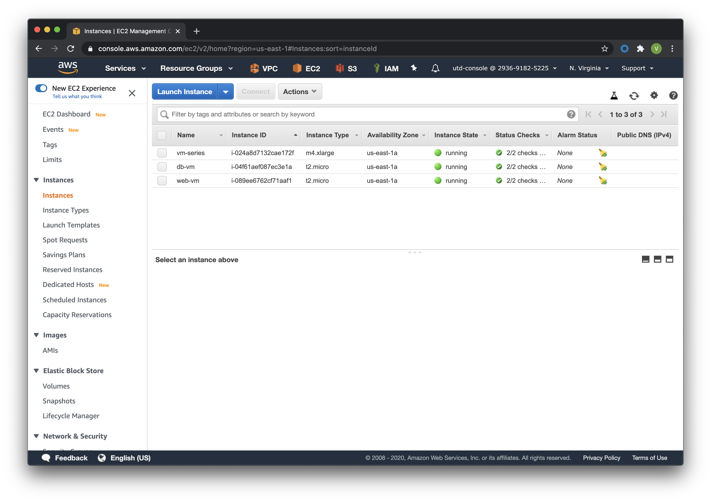

#####
Build
#####

Build your architecture as code (IaC) using Terraform.

In this activity you will:

- Use AWS environment variables
- Create an SSH key-pair
- Create the Terraform variables
- Initialize the AWS Terraform provider
- Deploy the lab infrastucture plan
- Confirm firewall bootstrap completion

You are now ready to deploy the lab infrastructure.

********************************
Create AWS environment variables
********************************

We will be deploying the lab infrastucture in AWS using Terraform.  A
predefined Terraform plan is provided that will initialize the AWS provider and
call modules responsible for instantiating the network, compute, and storage
resources needed.

In order for Terraform to do this it will need to authenticate to AWS using your AWS Access key ID and AWS Secret Key. Use the credentials downloaded in your csv file. ( see the doc `here </en/latest/00-getting-started/requirements.html#create-iam-account-for-api-access>`_. ):

.. warning:: Hard-coding credentials into any Terraform configuration is not recommended, and risks secret leakage should this file ever be committed to a public version control system (like github). Rather than write these as Terraform variables, we will use Linux environment variables. Static credentials can be provided by adding an access_key and secret_key in-line in the AWS provider block, **but this is not safe**

*Working on a private project with no public sources you could add the following snippet to a .tf file*:

.. code-block:: terraform

    provider "aws" {
      region     = "us-east-1"
      access_key = "my-access-key"
      secret_key = "my-secret-key"
    }

Instead create **environment variables**, you can provide your credentials via the ``AWS_ACCESS_KEY_ID`` and ``AWS_SECRET_ACCESS_KEY`` environment variables, representing your AWS Access Key and AWS Secret Key, respectively. Type the following commands in the terminal:

.. code-block:: console

    export AWS_ACCESS_KEY_ID=your-access-key-here
    export AWS_SECRET_ACCESS_KEY=your-secret-key-here

.. note:: Note that setting your AWS credentials using either these (or legacy) environment variables will override the use of AWS_SHARED_CREDENTIALS_FILE and AWS_PROFILE. The AWS_DEFAULT_REGION and AWS_SESSION_TOKEN environment variables are also used, if applicable.

**********************
Create an SSH key-pair
**********************

All AWS EC2 instances are required to have an SSH key-pair defined when the
instance is created.  This is done to ensure secure access to the instance will
be available once it is created.

Create an SSH key-pair with an empty passphrase and save them in the ``~/.ssh``
directory.

.. code-block:: console

    ssh-keygen -t rsa -b 4096 -N '' -f ~/.ssh/lab_ssh_key

******************************
Create the Terraform variables
******************************

Change into the AWS deployment directory.

.. code-block:: console

    cd ~/utd-automation/journey/deployment/aws

In this directory you will find the three main files associated with a
Terraform plan: ``main.tf``, ``variables.tf``, and ``outputs.tf``.  View the
contents of these files in your text editor to see what they contain and how they're structured. Launch VS Code from the console:

.. code-block:: console

    code main.tf variables.tf outputs.tf
    # or
    subl main.tf variables.tf outputs.tf

The file ``main.tf`` defines the providers that will be used and the resources
that will be created (more on that shortly).  Since it is poor practice to hard
code values into the plan, the file ``variables.tf`` will be used to declare
the variables that will be used in the plan (but not necessarily their values).
The ``outputs.tf`` file will define the values to display that result from
applying the plan.

Create a file called ``terraform.tfvars`` in the current directory that
contains the following variables and their values.  Fill in the quotes with the
AWS region name, the AWS availability zone, and the path to your SSH public key
file.

.. code-block:: console

    code terraform.tfvars
    # or 
    subl terraform.tfvars

Copy and paste the following snippet in your new file. **Change the values** for the Region and Availability Zone.
You can find more information about Region and AZ in the `AWS User Guide <https://docs.aws.amazon.com/AWSEC2/latest/UserGuide/using-regions-availability-zones.html>`_. And more information on Palo Alto Networks solutions on `TechDocs <https://docs.paloaltonetworks.com/vm-series/9-0/vm-series-deployment/set-up-the-vm-series-firewall-on-aws/deploy-the-vm-series-firewall-on-aws/obtain-the-ami/get-amazon-machine-image-ids.html>`_.

.. code-block:: terraform

    aws_region_name     = "YOUR-REGION"
    aws_az_name         = "YOUR AZ"
    public_key_file     = "/home/panadmin/.ssh/lab_ssh_key.pub"

.. warning:: Do not forget to save your changes to create the new file: :guilabel:`File` > :guilabel:`Save` or ``CTRL + S``.

You can find the available AZ for a region by typing the following command from the terminal (AWS Cli is required):

.. code-block:: console

    aws ec2 describe-availability-zones --region region-name

For example, for the United States - North Virginia (1st AWS Region and AZ):

.. code-block:: terraform

    aws_region_name     = "us-east-1"
    aws_az_name         = "us-east-1a"
    public_key_file     = "~/.ssh/lab_ssh_key.pub"

.. note:: On your Virtual Machine, a .gitignore file has been added at the root of your home path ``~/`` preventing the synchronisation of files like ``.tfvars``. You can remove files from the git process by adding the filename or the extension to the .gitignore: vim ~/.gitignore

*************************************
Initialize the AWS Terraform provider
*************************************

Once you've created the ``terraform.tfvars`` file and populated it with the
variables and values you are now ready to initialize the Terraform providers.
For this initial deployment we will only be using the
`AWS Provider <https://www.terraform.io/docs/providers/aws/index.html>`_.
This initialization process will download all the software, modules, and
plugins needed for working in a particular environment.

.. code-block:: console

    terraform init

*********************************
Deploy the lab infrastucture plan
*********************************

We are now ready to deploy our lab infrastructure plan.  We should first
perform a dry-run of the deployment process and validate the contents of the
plan files and module dependencies.

.. code-block:: console

    terraform plan

If there are no errors and the plan output looks good, let's go ahead and
perform the deployment.

.. code-block:: console

    terraform apply -auto-approve

At a high level these are each of the steps this plan will perform:

#. Run the ``bootstrap`` module
    #. Create an S3 bucket for the firewall bootstrap package
    #. Assign an IAM policy to the bucket allowing read access from the
       firewall instance
    #. Create the ``/config/init-cfg.txt``, ``/config/bootstrap.xml``,
       ``/software``, ``/content``, and ``/license`` objects in the bootstrap
       bucket
#. Run the ``vpc`` module
    #. Create the VPC
    #. Create the Internet gateway
    #. Create the ``management``, ``untrust``, ``web``, and ``database``
       subnets
    #. Create the security groups for each subnet
    #. Create the default route for the ``web`` and ``database`` subnets
#. Run the ``firewall`` module
    #. Create the VM-Series firewall instance
    #. Create the VM-Series firewall interfaces
    #. Create the Elastic IPs for the ``management`` and ``untrust`` interfaces
    #. Create an IAM instance profile for accessing the bootstrap bucket
#. Run the ``web`` module
    #. Create the web server instance
    #. Create the web server interface
#. Run the ``database`` module
    #. Create the database server instance
    #. Create the database server interface

The deployment process should finish in a few minutes and you will be presented
with the public IP addresses of the VM-Series firewall management and untrust
interfaces.  However, the VM-Series firewall can take up to *ten minutes* to
complete the initial bootstrap process.

It is recommended that you skip ahead and read the :doc:`../03-run/terraform/background-terraform` section while you wait.

********************************************************
Verify on AWS Console some elements created by terraform
********************************************************

You can log in to the AWS Console using your utd-console `IAM profile </en/latest/00-getting-started/requirements.html#create-iam-account-for-console-access>`_. Confirm that the 3 EC2 instances have been created by Terraform:

.. note:: The firewall will take between 5 to 10 minutes to be operational. To boot using the bootstrap file and auto-commiting the configuration.

**You deployed your infrastructure sucessfully, you can now proceed to the configuration.**