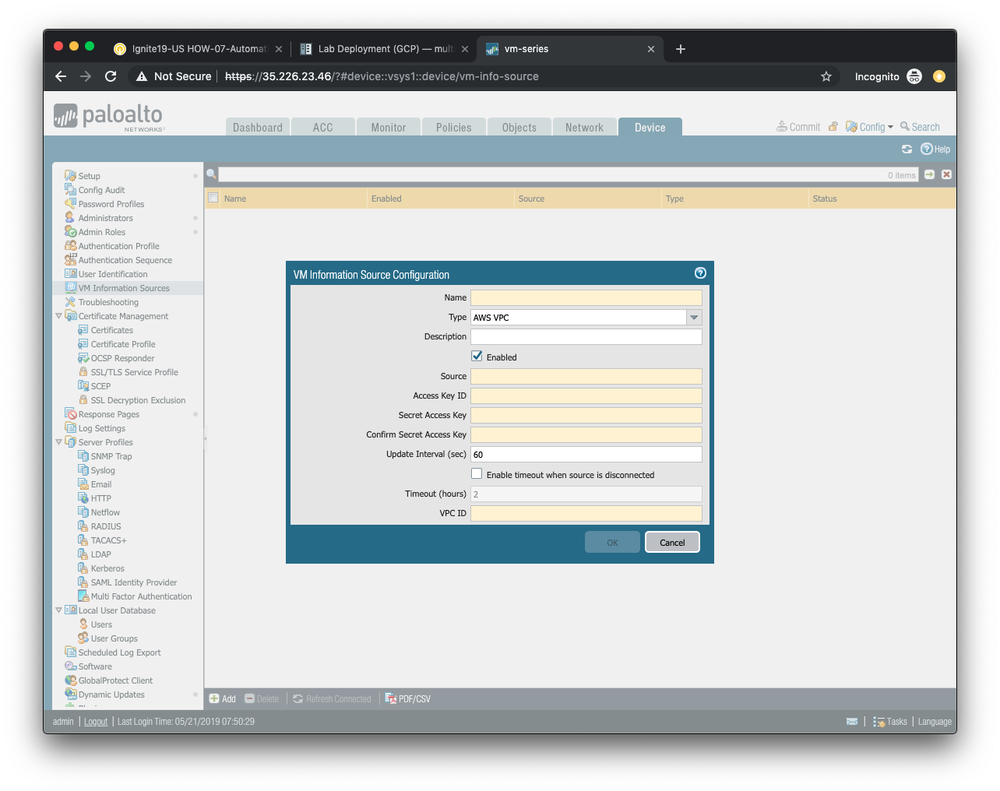
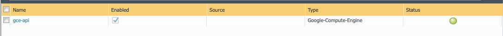
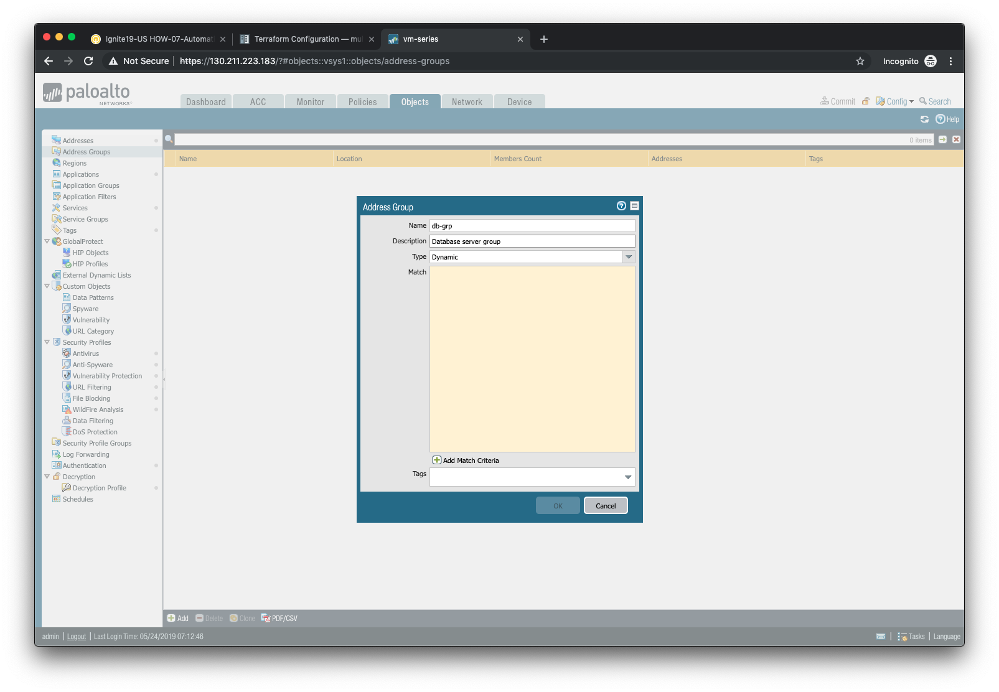
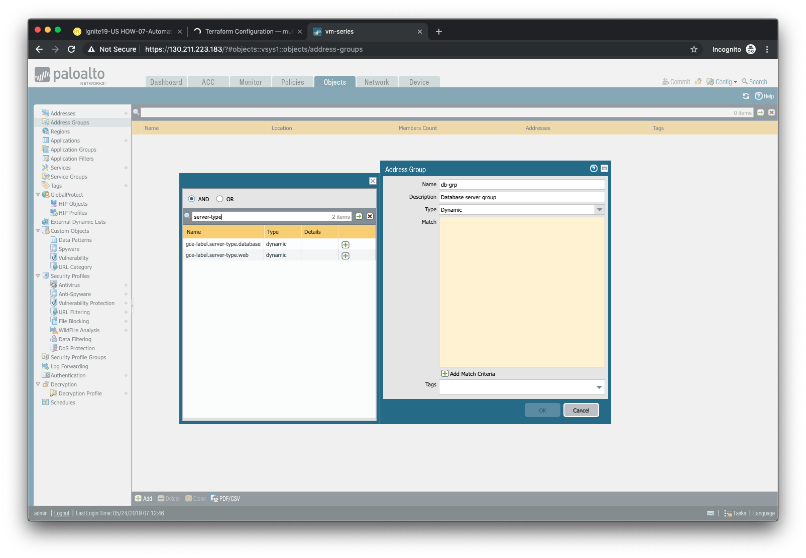
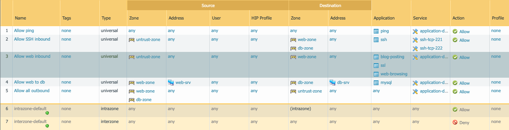
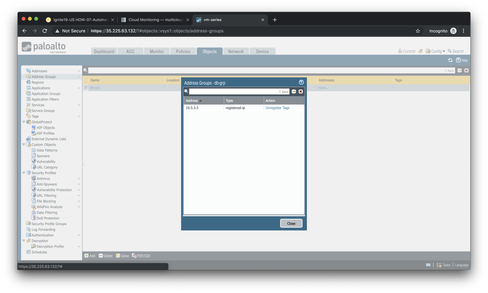
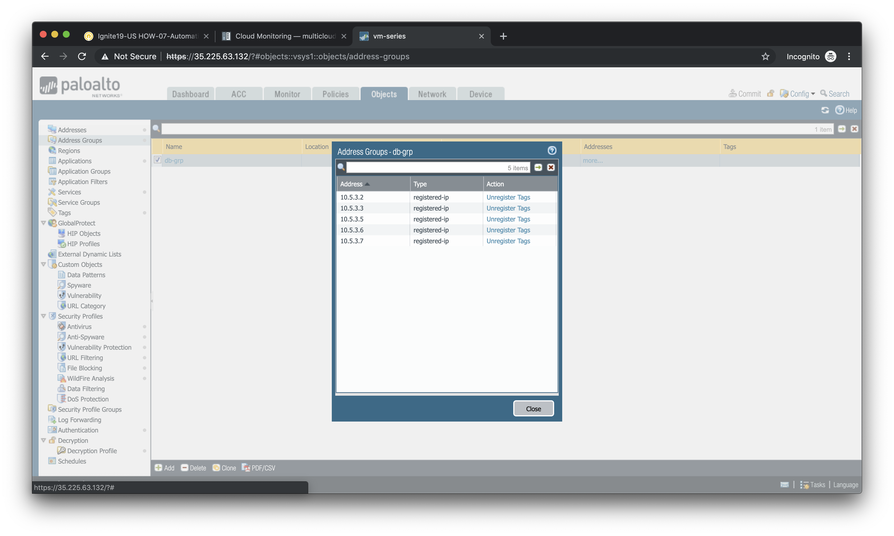

#######
Respond
#######

Respond with Palo Alto Networks

*******
Monitor
*******

In this activity you will:

- Create a VM Information Source (AWS)
- Verify cloud API connectivity

The automation tasks we've accomplished thus far have focused on deploying the VM-Series firewall and making changes to it externally via the API.  We'll now shift our focus to how PAN-OS can leverage third-party APIs to monitor its environment and automatically respond to changes it observes.

Create a VM Information Source (AWS)
====================================

We will be creating a VM Information Source on the firewall to monitor the AWS EC2 environment for meta-data about the running VM instances.  Open a web browser and go to ``https://<your-firewall-ip>``.  You will log in with the following credentials.

- **Username:** ``admin``
- **Password:** ``PaloAlto2005``

Once you have logged into the firewall, go to the **VM Information Sources** under the **Device** tab and click **Add**.

- Provide a name for your monitored source in the **Name** field.

- (optional) Provide a description of the monitored source in the **Description** field.

- Ensure that *AWS VPC* is selected from the **Type** field selection.

- Ensure that the **Enabled** button is selected.

- The **Source** field will contain the URI of the AWS region in which the lab is deployed.  The format for this is *ec2.<your_AWS_region>.amazonaws.com*. For example, if the region is *us-west-2* then the URI will be *ec2.us-west-2.amazonaws.com*.

- The **Access Key ID** Type ``env | grep AWS_ACCESS | cut -f2 -d "="`` to display your key ID in the terminal.

- The **Secret Access Key** Type ``env | grep AWS_SECRET | cut -f2 -d "="``  to display your secret key in the terminal.

- The **Update Interval**, and timeout fields can keep their default values.

- The **VPC ID** field will contain the AWS VPC value that was output during the deployment phase.  You can change into the AWS deployment directory and display the Terraform output values with the following commands.

.. code-block:: console

    cd ~/utd-automation/journey/deployment/aws
    terraform output

Click **OK** to accept the configuration.

Verify cloud API connectivity
=============================

Click **Commit** and commit the candidate configuration.

If the VM Information Source configuration was correct, you should see the status indicator for your source turn green.

    blah

If the status indicator is green, you can proceed to the next section.

***
DAG
***

In this activity you will:

- Create a Dynamic Address Group
- Define the attribute match criteria
- Apply the Dynamic Address Group to a rule

Dynamic Address Groups are policy object groups whose members are ephemeral in nature.  IP addresses are dynamically mapped to a Dynamic Address Group based on attribute match criteria.  These attributes are discovered from instances deployed in cloud environments and learned via cloud provider APIs.

Create a Dynamic Address Group
==============================

Navigate to **Objects > Address Groups** in the firewall web interface.

Click **Add** to create a new Dynamic Address Group.

In the **Address Group** window:

- Assign the name ``db-grp`` to the address groups.
- (optional) Provide a description of the address group.
- Select *Dynamic* from the **Type** drop-down menu.
- Click on **Add Match Criteria** to view the available attributes.

Define the attribute match criteria
===================================

The attributes displayed are discovered from the cloud provider API and are refreshed every *60 seconds*.  You will select the attributes that will need to be matched in order to associate a VM instance to your Dynamic Address Group.

Most of the attributes displayed are not needed.  However, each of the VM instances we've deployed have used a tag entitled ``server-type``.  Using the search bar at the top of the match criteria pop-up window, search for the term `server-type`.  Then add the result that has a value of ``database`` to the match criteria list.

Click **OK** when you are done.

Apply the Dynamic Address Group to a rule
================================================

Now that we've defined a VM Information Source and a Dynamic Address Group, let's put them to use.  Navigate to **Policies > Security** in the firewall web interface.

Find the rule that allows *mysql* traffic from the ``web-srv`` address object in the ``web-zone`` to the ``db-srv`` address object in the ``db-zone``.

Replace the ``db-srv`` destination with the ``db-grp`` Dynamic Address Group you've created.

Click **OK** and then commit your changes by clicking **Commit**.

*****
Scale
*****

In this activity you will:

- Determine Dynamic Address Group membership
- Scale out the database instances
- Confirm Dynamic Address Group changes

The combination of VM Information Sources and Dynamic Address Groups allows the firewall to respond to changes made to the cloud environment.  In this lab scenario you will scale out the number of database instances used to support the web application.  This should result in the automatic update of the Dynamic Address Group membership.

Determine Dynamic Address Group membership
==========================================

First, we should confirm that the one database instance we've already deployed has already been mapped to the Dynamic Address Group based on it's ``server-type`` attribute.

Navigate to **Objects > Address Groups** in the firewall web interface and select the Dynamic Address Group ``db-grp`` that you previously created.

Under the *Addresses* column, click on the link entitled ``more...``

You should see the IP address ``10.5.3.5``, which is the IP address of the existing database instance.

Click **Close** to close the pop-up window.

Scale out the database instances
================================

To scale out the number of database instances we'll go back to our Terraform deployment.

.. code-block:: console

    cd ~/utd-automation/journey/deployment/aws

In the ``main.tf`` file there is a module called ``scale`` that is commented out.  Open ``main.tf`` in a text editor and uncomment that entire section.

.. code-block:: console

    code main.tf

Do not forget to save the file (CTRL+S).

By uncommenting the ``scale`` module you have just added a new module to the Terraform plan.  This will require a re-initialization of the plan.

.. code-block:: console

    terraform init

Then plan again:

.. code-block:: console

    terraform plan

You can now apply the Terraform plan.

.. code-block:: console

    terraform apply

This will result in four new database instances being added to the database subnet.

Confirm Dynamic Address Group changes
=====================================

Now go back to the **Objects > Address Groups** section of the firewall web interface and click ``more...`` under the **Addresses** column of the ``db-grp`` entry.

You should now see a total of five IP addresses as members of the ``db-grp`` Dynamic Address Group.  These are now part of the destination match criteria for the databaase security rule.

.. note:: Remember that the VM Information Source is polling the cloud provider API every *60 seconds*.  If you do not see a total of five IP addresses in the Dynamic Address Group, close the window and click on ``more...`` again after a few moments.

