###
Run
###

Configure your settings using Terraform and Ansible.

*******************
Run using Terraform
*******************

In this activity you will:

- Initialize the Provider
- Configure Network Interfaces 
- Configure Virtual Router 
- Configure Security Zones 

For this portion of the lab, you will be using the Palo Alto Networks
`Terraform for PAN-OS provider <https://www.terraform.io/docs/providers/panos/index.html>`_.

First, change to the Terraform configuration directory.

.. code-block:: console

    cd ~/utd-automation/journey/configuration/terraform

Provider Initialization
=======================

Your first task is to set up the communications between the provider and your
lab firewall.  There's several ways this can be done.  The IP address,
username, and password (or API key) can be set as variables in Terraform, and
can be typed in manually each time the Terraform plan is run, or specified on
the command line using the ``-var`` command line option to ``terraform plan``
and ``terraform apply``.  You can also reference a JSON file in the provider
configuration which can contain the configuration.

Another way you can accomplish this is by using environment variables.  Use the
following commands to add the appropriate environment variables:

.. code-block:: console

    export PANOS_USERNAME="admin"
    export PANOS_PASSWORD="PaloAlto2005"
    export PANOS_HOSTNAME="<YOUR FIREWALL MGMT IP GOES HERE>"

.. note:: Replace the text ``<YOUR FIREWALL MGMT IP GOES HERE>`` with your firewall's management IP address.

Now, you should see the variables exported in your shell, which you can verify
using the ``env | grep PANOS`` command:

.. code-block:: console

    PANOS_USERNAME=admin
    PANOS_PASSWORD=PaloAlto2005
    PANOS_HOSTNAME=54.160.48.152

With these values defined, we can now initialize the Terraform panos provider with the following command.

.. code-block:: console

    terraform init

The provider is now ready to communicate with our firewall.

**************************************
Confirm firewall readiness (optionnal)
**************************************

Now the firewall should be up and running, you can SSH into the firewall with the following credentials:

- **Username:** ``admin``
- **Password:** ``PaloAlto2005``

.. code-block:: console

    ssh admin@

Enter the IP address of the firewall management
interface that was provided in the Terraform plan results.  This information
can be easily recalled using the ``terraform output`` command within the
deployment directory.

.. warning:: If you are unsuccessful the firewall instance is likely still
   bootstrapping or performing an autocommit.  Hit ``Ctrl-C`` and try again
   after waiting a few minutes.  The bootstrap process can take up to *ten
   minutes* to complete before you are able to successfully log in.

Once you have logged into the firewall you can check to ensure the management
plane has completed its initialization.

.. code-block:: console

    admin@lab-fw> show chassis-ready

If the response is ``yes``, you are ready to proceed with the configuration
activities.

.. note:: While it is a security best practice to use SSH keys to authenticate
          to VM instances in the cloud, we have defined a static password for
          the firewall's admin account in this lab (specifically, in the 
          bootstrap package).  This is because the PAN-OS XML API cannot utilize SSH keys and requires a
          username/password or API key for authentication.

Network Interfaces
==================

Your firewall has been bootstrapped with an initial password and nothing else.
We're going to be performing the initial networking configuration with
Terraform.

You've been provided with the following Terraform plan in ``main.tf``:

.. code-block:: terraform

    provider "panos" {}

    resource "panos_ethernet_interface" "untrust" {
        name                      = "ethernet1/1"
        vsys                      = "vsys1"
        mode                      = "layer3"
        enable_dhcp               = true
        create_dhcp_default_route = true
    }

    resource "panos_ethernet_interface" "web" {
        name        = "ethernet1/2"
        vsys        = "vsys1"
        mode        = "layer3"
        enable_dhcp = true
    }

    resource "panos_ethernet_interface" "db" {
        name        = "ethernet1/3"
        vsys        = "vsys1"
        mode        = "layer3"
        enable_dhcp = true
    }

This configuration creates your network interfaces.  The PAN-OS provider
doesn't need any additional configuration specified because it is pulling that
information from the environment variables we set earlier.

Now, you can run the ``terraform apply`` command, and the interfaces will be created on the
firewall.

.. code-block:: console

    terraform apply

Virtual Router
==============

Now, you'll have to assign those interfaces to the default virtual router.
You will need the
`panos_virtual_router <https://www.terraform.io/docs/providers/panos/r/virtual_router.html>`_
resource.

The example code from that page looks like this:

.. code-block:: terraform

    resource "panos_virtual_router" "example" {
        name = "my virtual router"
        static_dist = 15
        interfaces = ["ethernet1/1", "ethernet1/2"]
    }

Exercise:
---------
Open VS Code and edit the ``main.tf`` file to add a code snippet that will add a virtual router to your configuration, matchning the following settings:

.. code-block:: console

  code main.tf
  # or
  subl main.tf

.. figure:: img/terraform-vr.png

   Virtual router **default**.
   :align: center

Once the virtual router resource in ``main.tf`` has been added and the file saved (``CTRL+S``) you can run ``terraform apply``.

.. code-block:: console

    terraform apply

.. note:: When a value is by default, you do not need to specify it in your Terraform file. The Static Distance is 10 by default.

Security Zones
==============

Next is creating the security zones for the firewall.  You will need the
`panos_zone <https://www.terraform.io/docs/providers/panos/r/zone.html>`_ resource.

The example code from that page looks like this:

.. code-block:: terraform

    resource "panos_zone" "example" {
        name = "myZone"
        mode = "layer3"
        interfaces = ["${panos_ethernet_interface.e1.name}", "${panos_ethernet_interface.e5.name}"]
        enable_user_id = true
        exclude_acls = ["192.168.0.0/16"]
    }

    resource "panos_ethernet_interface" "e1" {
        name = "ethernet1/1"
        mode = "layer3"
    }

    resource "panos_ethernet_interface" "e5" {
        name = "ethernet1/5"
        mode = "layer3"
    }

Exercise:
---------
Open VS Code and edit the ``main.tf`` file to add a code snippet that will add three zones mapped with the right interfaces to your configuration, matchning the following settings:

.. code-block:: console
  code main.tf
  # or 
  subl main.tf

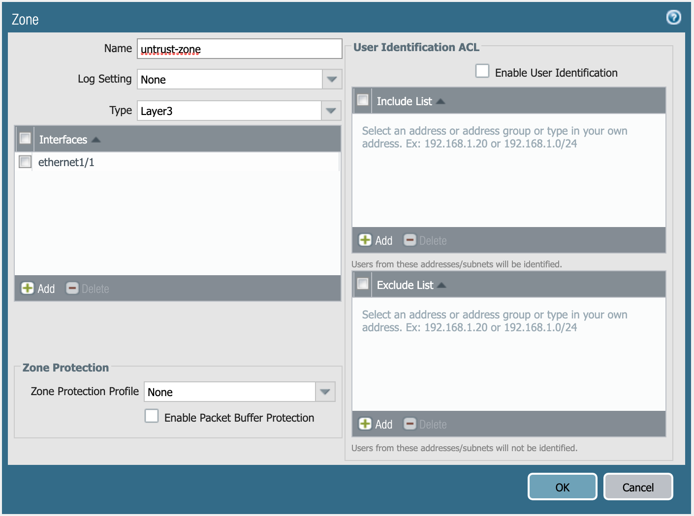

   Definition of **untrust-zone**.
   :align: center

.. figure:: img/terraform-web_zone.png

   Definition of **web-zone**.
   :align: center

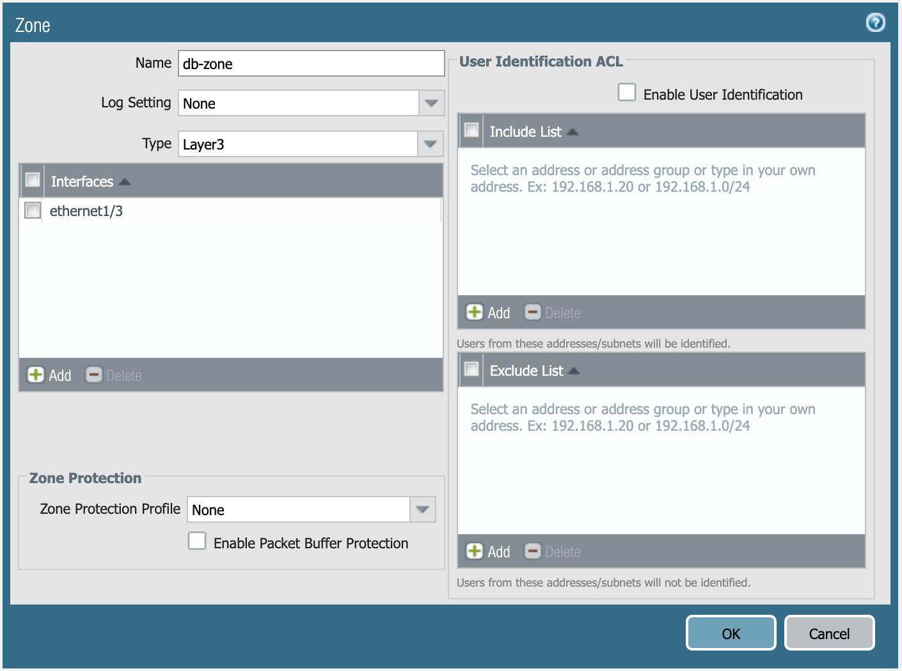

   Definition of **db-zone**.
   :align: center

Once the zones and mapping in ``main.tf`` have been added and the file saved (*CTRL+S*) you can run ``terraform apply``.

.. code-block:: console

    terraform apply

**You're done with the Terraform portion of the lab!**

*****************
Run using Ansible
*****************

In this activity you will:

- Define Module Communications
- Define Address Objects
- Define Service Objects
- Define Security Rules
- Define NAT Rules
- Commit the Configuration
- Run the Playbook

For this portion of the lab, you're going to be using the Palo Alto Networks
`Ansible modules <https://ansible-pan.readthedocs.io/en/latest/>`_.

First, let's change to the Ansible configuration directory.

.. code-block:: console

  cd ~/utd-automation/journey/configuration/ansible

Module Communications
=====================

.. informational:: Just like with Terraform, your first task is setting up the communication with the firewall.  The IP address, username, and password (or API key) can be set as variables or specified on the command line.  However, since we've already set them as environment variables during the Terraform Configuration, we can just read them in.

The ``vars.yml`` file contains the following:

.. code-block:: yaml

    provider:
      ip_address: "{{ lookup('env', 'PANOS_HOSTNAME') }}"
      username: "{{ lookup('env', 'PANOS_USERNAME') }}"
      password: "{{ lookup('env', 'PANOS_PASSWORD') }}"

This code simply reads the content of the environment variables (``env | grep PANOS``) we set in the
Terraform portion into the dictionary ``provider``.  This is then referenced by
our playbook file, ``playbook.yml``.

Similar to the Terraform portion of the lab, our firewall doesn't have any
objects or rules configured.  We're going to implement that with an Ansible
playbook.

.. note:: You wouldn't actually change tools in the middle of configuration
   like we're doing here.  We just want you to get exposure to both tools and see
   that you can accomplish the same tasks with either one.

Address Objects
===============

Open the ``playbook.yml`` file in your text editor.  

.. code-block:: console

  code playbook.yml
  # or
  subl playbook.yml

It will contain the following:

.. code-block:: yaml

    ---
    - hosts: localhost
      connection: local
      gather_facts: false

    vars_files:
      - vars.yml

    collections:
      - paloaltonetworks.panos

    tasks:
      - name: Create web server object
        panos_address_object:
          provider: "{{ provider }}"
          name: "web-srv"
          value: "10.5.2.5"
          commit: False
          state: present

      - name: Create DB server object
        panos_address_object:
          provider: "{{ provider }}"
          name: "db-srv"
          value: "10.5.3.5"
          commit: False
          state: present

This playbook creates the following address objects by using the
`panos_address_object module <https://ansible-pan.readthedocs.io/en/latest/modules/panos_address_object_module.html>`_.
Also notice the fact that ``commit`` is set to **False**, so that we don't have
to wait on a commit each time a module runs.

Service Objects
===============

Next, create some service objects.  We want to allow SSH on some non-standard
ports so we can easily communicate with web and DB servers behind our firewall.
You'll need to refer to the
`panos_service_object module <https://ansible-pan.readthedocs.io/en/latest/modules/panos_service_object_module.html>`_
documentation.

The example code for that module looks like this:

.. code-block:: yaml

          - name: Create service object 'ssh-tcp-22'
            panos_service_object:
              provider: '{{ provider }}'
              name: 'ssh-tcp-22'
              destination_port: '22'
              description: 'SSH on tcp/22'

Exercise:
---------
Use the ``panos_service_object`` module to create two objects with the
following definitions:

.. figure:: img/ansible-service-tcp-221.png

   **service-tcp-221** service object.

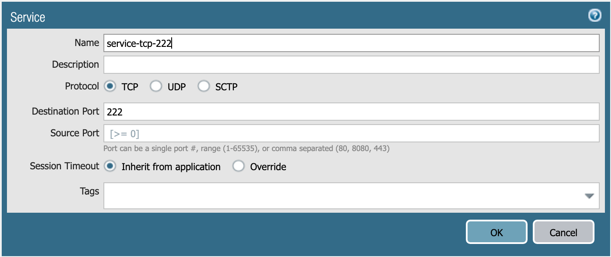

   **service-tcp-222** service object.

Security Rules
==============

Now we need to create security rules to allow traffic.  You'll need to refer to
the `panos_security_rule module <https://ansible-pan.readthedocs.io/en/latest/modules/panos_security_rule_module.html>`_
documentation.

The example code for that module looks like this:

.. code-block:: yaml

    - name: add SSH inbound
      panos_security_rule:
        provider: '{{ provider }}'
        rule_name: 'SSH permit'
        description: 'SSH rule test'
        source_zone: ['public']
        source_ip: ['any']
        destination_zone: ['private']
        destination_ip: ['1.1.1.1']
        application: ['ssh']
        action: 'allow'

Exercise:
---------
Use the ``panos_security_rule`` module to create the following security rules:

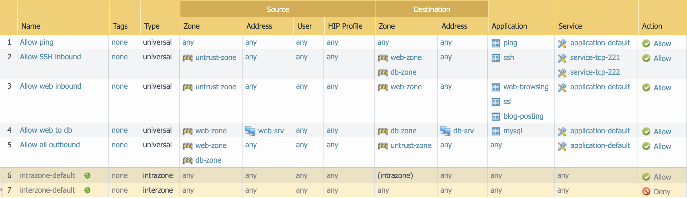

   Security rules to be created.

NAT Rules
=========

Now we need to create the required NAT rules.  You'll need to refer to the
`panos_nat_rule module <https://ansible-pan.readthedocs.io/en/latest/modules/panos_nat_rule_module.html>`_
documentation.

The example code for that module looks like this:

.. code-block:: yaml

    - name: Create NAT SSH rule for 10.0.1.101
      panos_nat_rule:
        provider: '{{ provider }}'
        rule_name: "Web SSH"
        source_zone: ["external"]
        destination_zone: "external"
        source_ip: ["any"]
        destination_ip: ["10.0.0.100"]
        service: "service-tcp-221"
        snat_type: "dynamic-ip-and-port"
        snat_interface: "ethernet1/2"
        dnat_address: "10.0.1.101"
        dnat_port: "22"

Exercise:
---------
Use the ``panos_nat_rule`` module to create the following NAT rules:

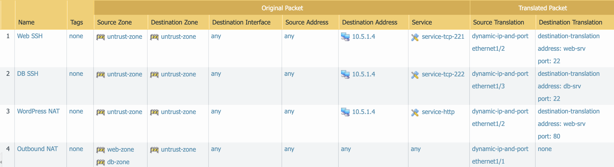

   NAT rules to be created.

.. note:: Pay attention to the module arguments for ``panos_nat_rule``.  **destination_zone**
          and **service** are strings here, not lists.  This is because you can't
          write a NAT rule on PAN-OS with multiple destination zones or services.

Commit the Configuration
========================

If you have been writing your playbook with ``commit`` set to **False** each
time, you have an uncommitted candidate configuration.  There's a panos_commit
module to perform a commit.

The example code for the module should do what you need, copy and paste the following snippet to your ``playbook.yml`` file:

.. code-block:: yaml

  - name: commit candidate config on firewall
    panos_commit:
      provider: '{{ provider }}'

Run the Playbook
================

Don't forget to save your ``playbook.yml`` file.  Then run your playbook with the
following command:

.. code-block:: console

   ansible-playbook -i inventory playbook.yml

Log in to the web UI of the firewall, and verify that the configuration matches
what you want.  If you get errors, indentation is most likely the problem.
Ansible is very particular about lines being indented with spaces and not with
tabs.

**You're now done with the Ansible portion of the lab!**

******************
Validation Testing
******************

In this activity you will:

- Access the Apache web server
- Access the WordPress application
- Post a blog article
- Verify firewall rule matches

The previous two activities had you deploy and configure the infrastructure
supporting our WordPress application.  Now it's time to see if everything
works as planned.  If so, you should be able to access the application, post
a blog article, and verify that the appropriate firewall rules are being hit.
If not, you will need to troubleshoot your configs and make the necessary
corrections.

Access the Apache web server
============================
The web server is using the firewall's untrust interface address in a
destination NAT rule.  Run the following commands to determine the IP
address of this interface.

.. code-block:: console

    cd ~/utd-automation/journey/deployment/aws
    terraform output

Open a new tab in your web browser and go to ``http://<web-server-ip-address>``.
You should see the Apache default home page.

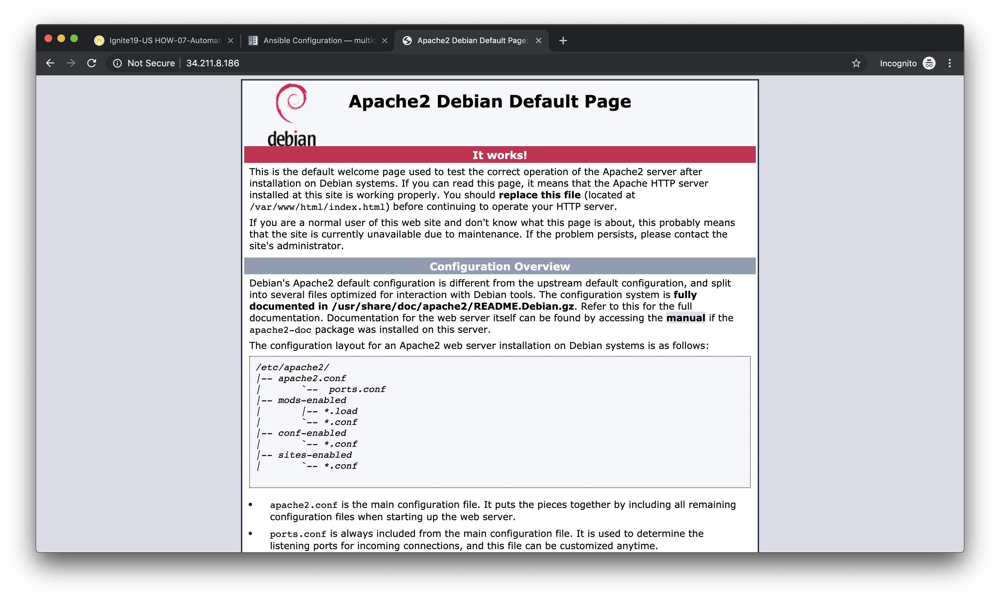

Access the WordPress application
================================
Append ``/wordpress`` to the end of the web server URL and the WordPress
installation page should be displayed.

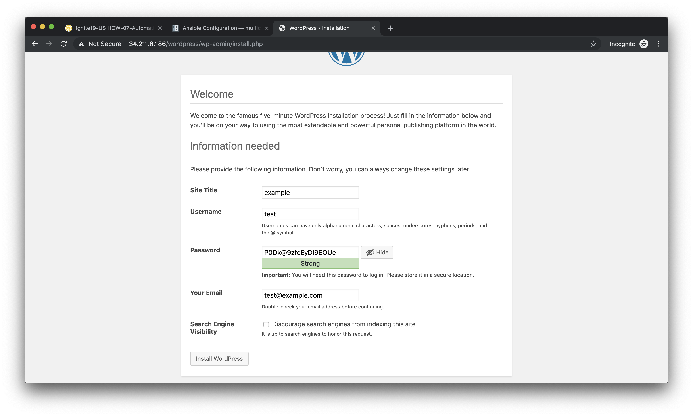

Fill in values of your choosing for the **Site Name**, **Username**, and
**Your Email**.  These are only for testing and do not need to be real values.

.. note:: Make sure you copy the password that is provided to your clipboard.
    Otherwise you may not be able to log in once WordPress is installed.

Click **Install WordPress** when you are done.

On the following page, click on **Log In** to log into the WordPress
administrator dashboard.

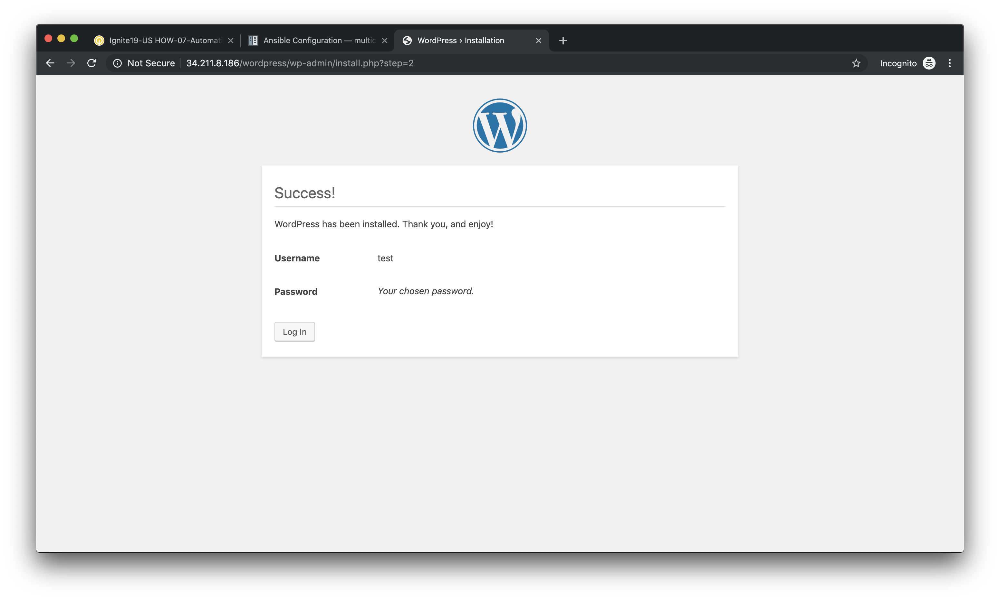

Log into WordPress using the username and password you created.

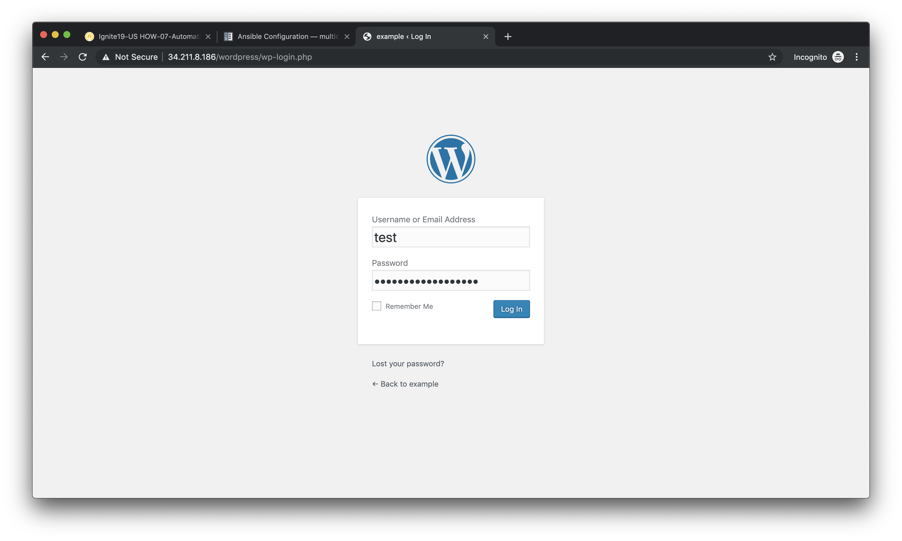

You will then be presented with the WordPress administrator dashboard.

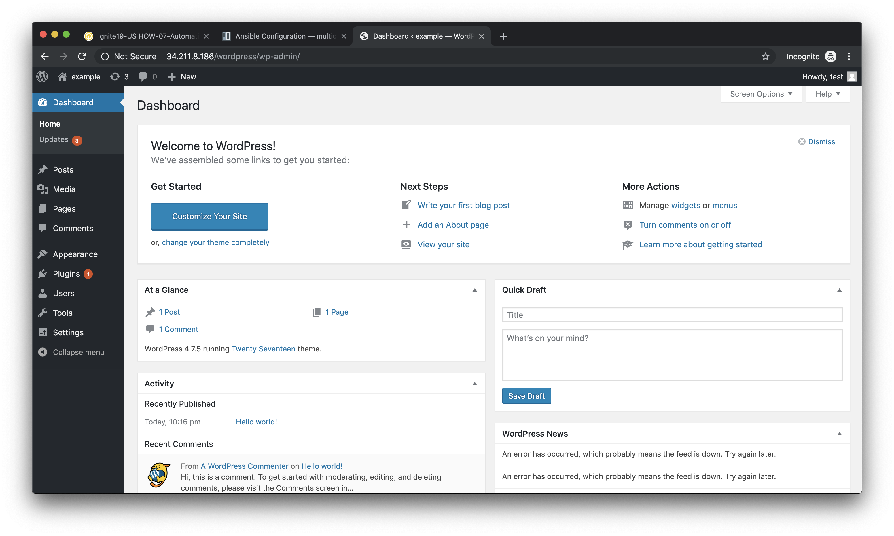

Post a blog article
===================
Now that you've successfully logged into the WordPress administrator dashboard,
let's post an update to the blog.

Click on **Write your first blog post** under the **Next Steps** section.  You
will be presented with the **Add New Post** editor.

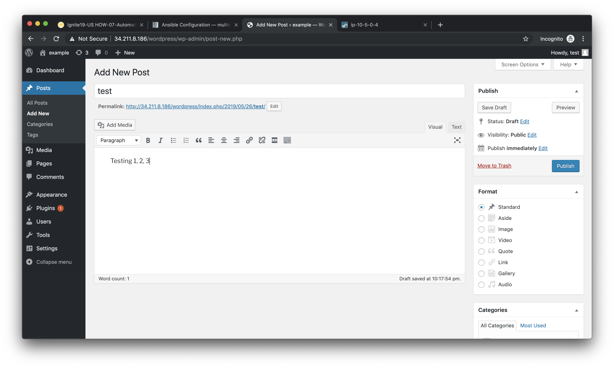

Enter a title for your post and some sample content.  Then click on **Publish**
to post the update.

You can then click on **Preview** to see the published blog update.

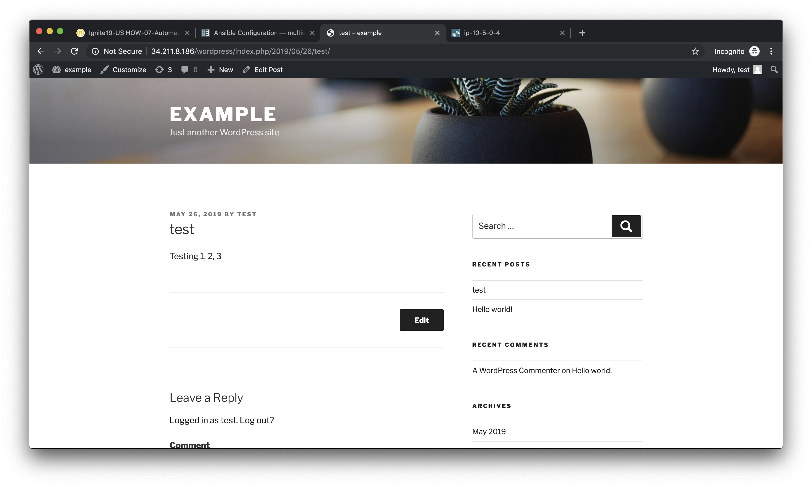

Verify firewall rule matches
============================
Now that we've confirmed the WordPress application is working properly, let's
see what is happening with our firewall rules.

Log into the firewall administrator web interface at ``https://<firewall-management-ip>``
and navigate to **Policies > Security**.

If you scroll to the right you will see details on the security rules that are
being hit.

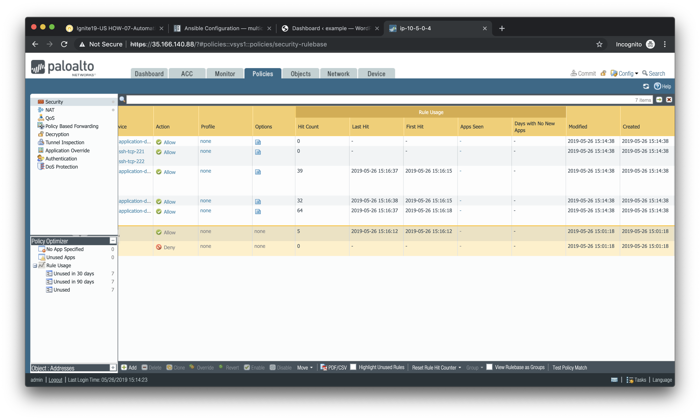

Scroll back to the left, find the security rule entitled *Allow web inbound*.
Then click on the drop-down menu icon to the right of the rule name and
select **Log Viewer*.

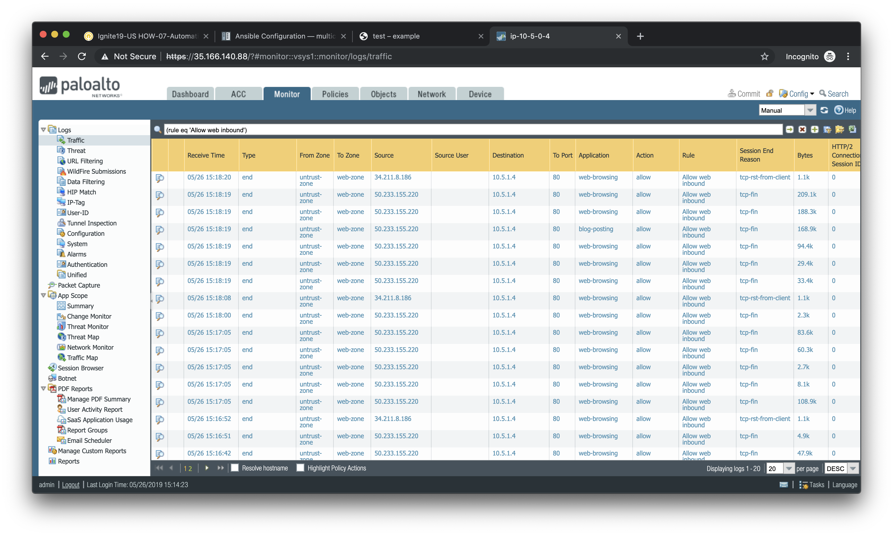

You will see all of the logs associated with inbound web traffic.  Notice the
applications identified are *web-browsing* and *blog-posting*.

.. note:: You may find source IPs other than your own as the web server is open
    to the public and will likely be discovered by web crawlers and other discovery
    tools aimed at public cloud providers.

Navigate back to **Policies > Security** and click on the **Log Viewer** for
the *Allow web to db* rule.

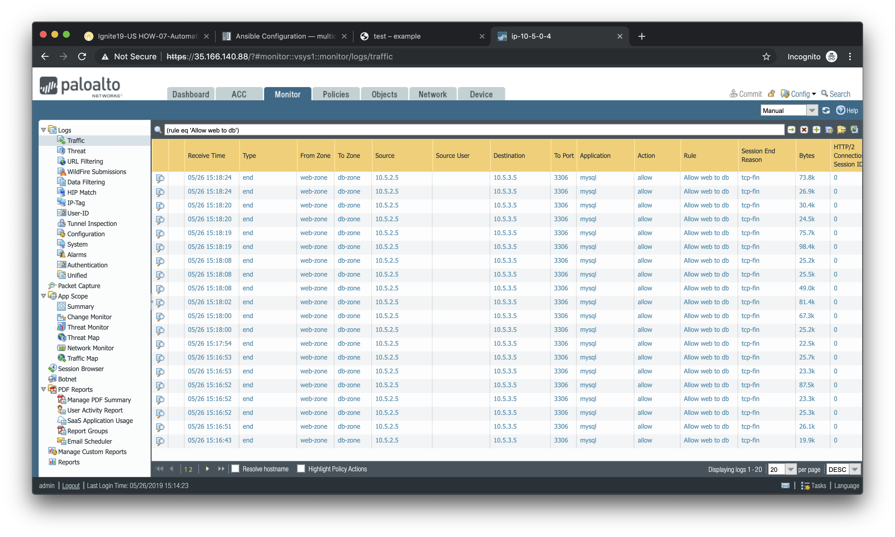

You will see all of the MySQL (actually MariaDB) database traffic between the
WordPress web server and the database backend.
