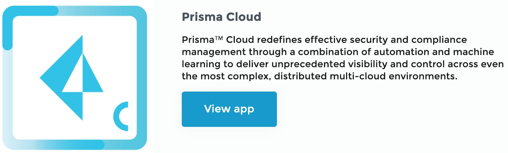
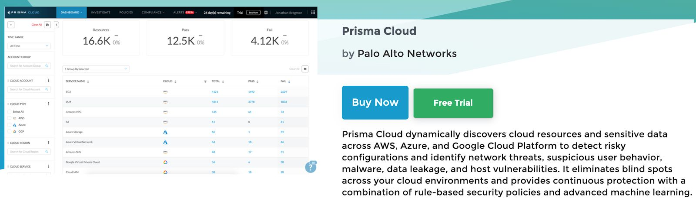

========================
Activity 6: Prisma Cloud
========================

.. figure:: img/work-in-progress.png

Subscribe to Prisma Cloud Free Trial Version:
---------------------------------------------

Prisma Cloud is a SaaS service and it’s subscription is available from Palo Alto
Networks, GCP and AWS Marketplace. The free trial version is currently offered only
from Palo Alto Networks marketplace. In this task we will show, how you can subscribe
to the Prisma Cloud free trial version from Palo Alto Networks Marketplace. After
completing the trial account registration process, your trial tenant will be ready for you in
a few hours. You can use your new trial tenant to learn more about Prisma Cloud.

Step 1: Go to Palo Alto Networks Marketplace
https://marketplace.paloaltonetworks.com/

Step 2: Scroll down and then click on ​ View app​ .

Step 3: Click on ​ Free Trial​ and then Create Account.
NOTE: ​ The free trial version is valid for 30 days.

Step 4: Enter the personal and company information requested in the form. 
Required fields are indicated with red asterisks.​ ​ Accept the privacy agreement and click
on ​ Create an account​ .
NOTE:​ Personal email like gmail is not allowed to create a new account. You
need to use your company email ID to create an account.

Step 5: It will take a couple of hours to provision the Prisma Cloud tenant. You will
receive a welcome email that includes a link to log in to the Prisma Cloud
tenant once it’s ready.

On-board a AWS Account :
------------------------

.. figure:: img/work-in-progress.png

https://docs.paloaltonetworks.com/prisma/prisma-cloud/prisma-cloud-admin/connect-your-cloud-platform-to-prisma-cloud/onboard-your-aws-account/add-aws-cloud-account-to-prisma-cloud.html#id8cd84221-0914-4a29-a7db-cc4d64312e56

To begin monitoring the resources on your cloud infrastructure, you must first connect your public cloud accounts to Prisma™ Cloud. When you add your cloud account to Prisma 
Cloud, the API integration between your cloud infrastructure provider and Prisma Cloud is established and you can begin monitoring the resources and identify potential security 
risks in your infrastructure.

To get the most out of your investment in Prisma™ Cloud, you first need to add your cloud accounts to Prisma Cloud. This process requires that you have the correct permissions 
to authenticate and authorize the connection and retrieval of data.
Prisma Cloud administrators with the System Administrator and Cloud Provisioning Administrator roles can use the cloud account onboarding guided tour for a good first-run experience 
with all supported cloud platforms—Alibaba Cloud, AWS, Azure, and Google Cloud. The workflow provides the context you need to make decisions based on your own security and compliance 
requirements and it uses automation scripts—Cloud Formation templates for AWS or Terraform templates for Azure and GCP—to create the custom roles and enable the permissions required 
to add a cloud account.
When you log in to Prisma Cloud for the first-time, the guided tour displays after the welcome tour and prompts you to pick a cloud platform to add to Prisma Cloud.

To connect your public AWS or AWS GovCloud account to Prisma™ Cloud, you must complete some tasks on the AWS management console and some on Prisma Cloud. The onboarding workflow 
enables you to create a Prisma Cloud role with either read-only access to your traffic flow logs or with limited read-write access to remediate incidents. With the correct 
permissions, Prisma Cloud can successfully connect to and access your AWS account(s).

Etape 1 : Add an AWS Cloud Account on Prisma Cloud:
---------------------------------------------------
If you would like Prisma Cloud to ingest VPC flow logs and any other integrations, such as Amazon GuardDuty or AWS Inspector, you must enable these services on the AWS management 
console. The CFT enables the ingestion of configuration data and AWS CloudTrail logs (audit events) only. VPC flow logs and any other integrations, such as Amazon GuardDuty or AWS 
Inspector are retrieved only if you previously enabled these services for the AWS account that you are onboarding.

[Optional] On-board a GCP Account:
----------------------------------

.. figure:: img/work-in-progress.png

Prisma Cloud Security Alert Investigation and Remediation :
-----------------------------------------------------------

.. figure:: img/work-in-progress.png

Investigate Network Alerts
Investigate Audit Alerts
Locate and remediate a security event

